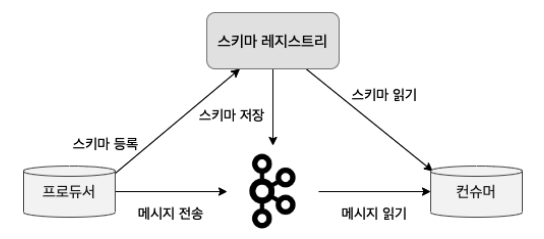
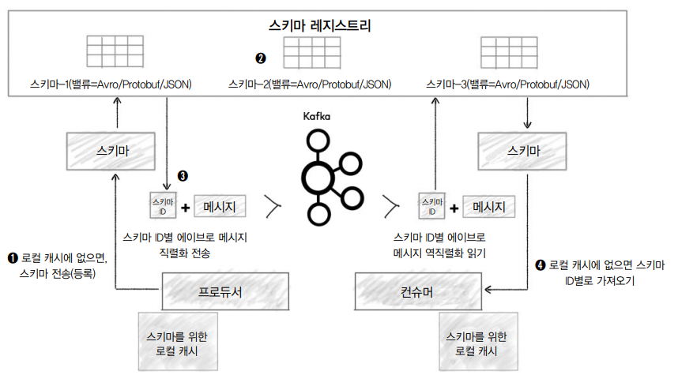

## 10장(스키마 레지스트리)

### 스키마
* 스키마란 정보를 구성해고 해석하는 것을 도와주는 프레임워크나 개념
* ex) 데이터베이스 구조 정의

### 카프카의 스키마 정의 장/단점
* 장점
  * 수많은 사람들이 여러개의 토픽을 사용함, 누군가가 정의되지 않은 데이터를 실수로 프로듀싱하게 된다면 큰 장애가 발생할 것, 해당 부분을 방지할 수 있다
  * 카프카의 데이터 흐름은 프로듀서를 일방적으로 신뢰할 수 밖에 없는 구조(브로드캐스트 방식)
  * 스키자 진화를 제공함, 필드 추가 시 별다른 영향없이 수정 가능
* 단점 
  * 스키마 정의 시간이 오래 걸린다

### 스키마 레지스트리 
* 스키마 레지스트리 : 스키마 등록 및 관리하는 애플리케이션, 카프카 0.8.2 버전과 같이 공개됐으며 아래와 같은 구성
  
* 그림과 같이 프로듀서, 컨슈머와 모두 통신한다
* 스키마 레지스트리를 사용하기 위해서는 스키마 레지스트리가 지원하는 데이터 포맷(JSON, 프로토콜 버터 등..)을 선택해야 한다. 대표적인 포맷은 에이브로이다
* 에이브로를 활용한 학생 명단에 대한 스키마 정의 파일은 아래와 같다
  ```json
  {
    "namespace":"student.avro", //이름 식별 문자열
    "type":"record", // 문자열 타입 정의
    "doc":"This is an example of Avro.", //스키마 정의 설명
    "name":"Student", // 이름
    "field":[ // 데이터
      {
        "name":"name",
        "type":"string",
        "doc":"Name of the student"
      },
      {
        "name":"name",
        "type":"string",
        "doc":"Class of the student"
      }
    ]
  }
  ```

### 스키마 레지스트리와 클라이언트 동작  
* 프로듀서와 컨슈머는 서로 통신을 주고받지 않음. 컨슈머는 프로듀서가 정의한 스키마 정보를 얻기 위해 스키마 레지스트리와 통신한다
  

### 스키마 레지스트리 호환성
* 호환성 : 스키마가 변경될 때마다 스키마가 진화한다. 이 해당 진화한 스키마들중에서 어디까지 호환되는지 검사해야 한다. 대표적으로 BACKWARD, FORWARD, FULL 등의 호환성 레벨을 제공한다
* BACKWORD 호환성 : 
  * 진화된 스키마를 가지고 있는 컨슈머가, 한 단계 이전 스키마가 적용된 프로듀서가 보낸 메시지를 읽을 수 있음
  * 전체 이전 버전의 메시지를 읽으려면 BACKWARD_TRANSITIVE 로 설정해야 함
* FORWARD 호환성 :
  * 한 단계 이전의 스키마를 가지고 있는 컨슈머가, 진화된 스키마를 가진 프로듀서가 보낸 메시지를 읽을 수 있음
  * 전체 메시지를 읽으려면 FORWARD_TRANSITIVE 로 설정해야 함
* FULL 호환성 : 
  * BACKWORD + FORWARD 
  * 전체 메시지를 읽으려면 FULL_TRANSITIVE 로 설정해야 함
