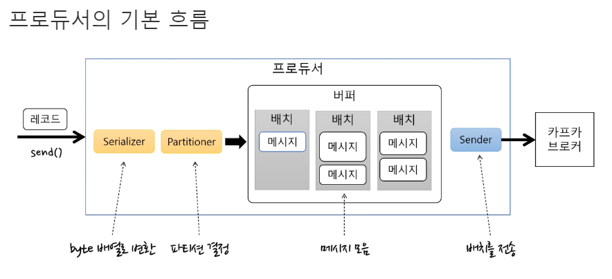
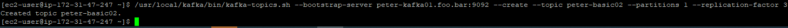
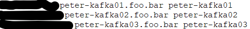

## 1 ~ 2 장 간략 정리
* 아파치 카프카는 링크드인에서 대용량 데이터 처리를 위해서 내부적으로 만들어진 프로젝트, 추후 오픈소스화 되었음


* 카프카를 사용해야 하는 이유 
  * 큰 데이터를 다루는 여러 회사에서 성공적으로 사용되고 있음
  * 카프카를 사용하는 곳이 많으므로, 새로운 인력 수급이 용이(내부적으로 데이터 처리 로직을 가지고 있다면, 인력 이탈 시 유지보수가 힘듬)
  * 데이터 처리가 많을 경우 확장이 용이, 복제본 생성, 관리 기능의 편리함 등
  

* AWS 를 통한 인스턴스 생성 및 kafka 환경 세팅 및 실습
  * 아래 그림과 같이 EC-2 인스턴스 구성 후 간단한 쉘 예제로 producer, consumer 실습
    

## 3장 (카프카 기본 개념과 구조)
* 카프카 구성 요소
  * 주키퍼 : 분산 시스템 코디네이터, 분산 시스템에 대한 조율(상태체크, 마스터 노드 선정)을 쉽게 할 수 있는 서비스. 카프카는 주키퍼에 의존성을 가지고 있으며 최신 버전에서는 의존성이 제거되었음
  * 브로커 : 카프카가 설치된 서버를 의미함
  * 프로듀서 : 카프카에 메시지를 보내는 역할을 하는 클라이언트
  * 컨슈머 : 카프카에서 메시지를 꺼내 쓰는 역할을 하는 클라이언트
  * 토픽 : 카프카에서 메시지의 주제를 구분하는 이름
  * 파티션 : 고성능의 처리를 위해 토픽이 여러 갈래로 분산되어 저장되는 단위
  * 세그먼트 : 로컬 디스크에 저장된 메시지 리스트 파일
  * 메시지 : 카프카에 전송되거나 읽을 수 있는 데이터


* 리플리케이션 
  * 토픽 기준으로 카프카의 안정성(메시지 유실, 혹은 서버 다운) 을 위해 카프카 클러스터 내 브로커들에 복제본을 분산시켜 저장하는 동작
  * 토픽 전체가 복제되는 것이 아닌, 토픽 내의 파티션이 복제되어 여러 서버로 분산됨(elasticsearch 의 shard 와 비슷)
  * 리플리케이션의 목적은 '안정성' 이다. 특정 서버의 장애 발생시 복제본을 이용해 데이터 유실 및 복구에 대한 처리가 가능하게 된다
  * 리플리케이션 개수는 장단점이 존재하는데, 많으면 처리성능이 떨어지고 적으면 장애대응시 문제가 발생할 수 있다. 운영 상에서는 3개가 권장된다
  * 원본과 복제본을 구분하기 위해 원본은 '리더' 복제본은 '팔로워' 라고 칭한다.
  * 리더에서 모든 프로듀서, 컨슈머로부터 오는 읽기/쓰기 요청을 처리하며 팔로워는 리더로부터 단순히 리플리케이션만 수행한다.


* 파티션
  * 토픽의 처리 성능을 높이기 위해 한 개의 토픽을 분산하여 저장하는 단위 
  * 나눠진 파티션 개수만큼, 컨슈머를 연결할 수 있음
  * 토픽에 대한 파티션의 개수는 절대적인 기준은 없다, 다만 한번 설정되면 늘릴수는 있지만 줄일 수는 없으므로 작게 설정한 뒤 모니터링하며 늘려가는 방식이 권장된다


* 세그먼트 
  * 토픽에 보내진 메시지가 로그 파일의 형태로 로컬 디스크에 저장된 것을 의미
  * 파티션의 하위에 N 개로 분산되어 저장되며, /data/kafka-logs/{topic 이름}-{파티션 넘버}/ 하위 디렉토리에 저장된다


* 카프카가 높은 처리량과 안정성을 가진 이유
  * 분산 시스템 : 여러 서버로 된 분산 시스템은, 서버 장애시 복구가 원활하고 높은 처리량을 가질 수 있게 된다. 또한 처리량에 따라 브로커 수를 계속해서 추가할 수 있다
  * 페이지 캐시 : 운영체제에서 사용하는 페이지 캐시를 사용할 수 있도록 기능을 제공한다.
    * OS 에서 메모리 사용 비율은 성능에 영향을 주지 않는다. 따라서 OS는 성능을 높이기 위해 남는 메모리를 파일 데이터를 캐싱하는데 이용한다.
    * 카프카가 페이지 캐시를 활용하므로, 해당 기능의 성능을 높이기 위해서는 OS에 남는 메모리를 충분히 할당해 주어야 한다        
  * 배치 전송 처리 : 네트워크 비용이 가장 크므로, 발생하는 이벤트들을 배치로 묶어서 전송하여 처리량을 높일 수 있다.
  * 압축 전송 : 압축 알고리즘을 이용해 데이터를 압축하여 네트워크 전송 비용을 줄일 수 있다. 압축 알고리즘은 데이터 형태에 따라 차이가 나므로 적절한 알고리즘을 테스트 후 적용해야 한다.


* 오프셋
  * 카프카의 파티션 내에 저장되는 메시지 데이터에 대한 순차적인 넘버링(64비트 정수)
  * 오프셋을 통해 메시지의 순서를 보장하고 컨슈머가 어디까지 읽었는지 알 수 있다.


* 프로듀서 흐름

  
  
  * 프로듀서의 각 항목 설명
    * 레코드 :  토픽/파티션/키/밸류로 구성된 카프카에 전송할 메시지 형태
    * serializer : 메시지를 바이트화
    * partitioner : 메시지가 어느 파티션에 들어갈지 선택
    * 배치 : 메시지의 모음, 토픽의 파티션 별로 배치가 쌓인다
    * sender : 배치가 모였거나, 특정 시간이 초과하면 배치를 카프카 브로커에 전송하는 부분을 담당
  * 프로듀서의 전송 방식
    * 프로듀서는, 대기 시간이 초과하거나, 메시지 배치가 알맞게 차면 sender 를 이용해서 카프카 브로커로 배치를 전송한다  
    * 전송 방식에는 메시지를 보내고 확인하지 않기, 동기전송, 비동기 전송이 있음

    
* 프로듀서 실습
  1. 프로듀서 토픽 생성
     
  2. etc-hosts 파일 이용하여 domain -> ec2 매핑

     
  3. 메시지를 보내고 확인하지 않기(유실되도 상관 없을 경우 사용)
    ```java

    import org.apache.kafka.clients.producer.KafkaProducer;
    import org.apache.kafka.clients.producer.Producer;
    import org.apache.kafka.clients.producer.ProducerRecord;

    import java.util.Properties;

    public class ProducerFireForgot {
    public static void main(String[] args) {
    Properties props = new Properties(); //Properties 오브젝트를 시작.
    props.put("bootstrap.servers", "peter-kafka01.foo.bar:9092,peter-kafka02.foo.bar:9092,peter-kafka03.foo.bar:9092"); //브로커 리스트를 정의.
    props.put("key.serializer",
    "org.apache.kafka.common.serialization.StringSerializer"); //메시지 키와 벨류에 문자열을 사용하므로 내장된 StringSerializer를 지정.
    props.put("value.serializer",
    "org.apache.kafka.common.serialization.StringSerializer");

            Producer<String, String> producer = new KafkaProducer<>(props); //Properties 오브젝트를 전달해 새 프로듀서를 생성.

            try {
                for (int i = 0; i < 10; i++) {
                    ProducerRecord<String, String> record = new ProducerRecord<>("peter-basic02", "Apache Kafka is a distributed streaming platform - " + i); //ProducerRecord 오브젝트를 생성.
                    producer.send(record); //send()메소드를 사용하여 메시지를 전송 후 Java Future Ojbect로 RecordMetadata를 리턴 받지만, 리턴값을 무시하므로 메시지가 성공적으로 전송되었는지 알 수 없음.
                }
            } catch (Exception e){
                e.printStackTrace(); //카프카 브로커에게 메시지를 전송한 후의 에러는 무시하지만, 전송 전 에러가 발생하면 예외를 처리할 수 있음.
            } finally {
                producer.close(); // 프로듀서 종료
            }
        }
    }

    ```
    * 메시지를 보내고 확인하지 않는 것은 카프카와 프로듀서가 정상적으로 운영된다면 문제 없으나, 실제 운영환경에서 사용하는 것이 추천되지 않음
    
  4. 메시지를 보내고 확인(메시지 전달 성공 여부 확인 시 사용)
    ```java
    import org.apache.kafka.clients.producer.KafkaProducer;
    import org.apache.kafka.clients.producer.Producer;
    import org.apache.kafka.clients.producer.ProducerRecord;
    import org.apache.kafka.clients.producer.RecordMetadata;
    
    import java.util.Properties;
    
    public class ProducerSync {
    public static void main(String[] args) {
    Properties props = new Properties(); //Properties 오브젝트를 시작.
    props.put("bootstrap.servers", "peter-kafka01.foo.bar:9092,peter-kafka02.foo.bar:9092,peter-kafka03.foo.bar:9092"); //브로커 리스트를 정의.
    props.put("key.serializer",
    "org.apache.kafka.common.serialization.StringSerializer"); //메시지 키와 벨류에 문자열을 사용하므로 내장된 StringSerializer를 지정.
    props.put("value.serializer",
    "org.apache.kafka.common.serialization.StringSerializer");
    
            Producer<String, String> producer = new KafkaProducer<>(props); //Properties 오브젝트를 전달해 새 프로듀서를 생성.
    
            try {
                for (int i = 0; i < 3; i++) {
                    ProducerRecord<String, String> record = new ProducerRecord<>("peter-basic02", "Apache Kafka is a distributed streaming platform - " + i); //ProducerRecord 오브젝트를 생성.
                    RecordMetadata metadata = producer.send(record).get(); //get() 메소드를 이용해 카프카의 응답을 기다립니다. 메시지가 성공적으로 전송되지 않으면 예외가 발생하고, 에러가 없다면 RecordMetadata를 얻음.
                    System.out.printf("Topic: %s, Partition: %d, Offset: %d, Key: %s, Received Message: %s\n", metadata.topic(), metadata.partition()
                            , metadata.offset(), record.key(), record.value());
                }
            } catch (Exception e){
                e.printStackTrace(); //카프카로 메시지를 보내기 전과 보내는 동안 에러가 발생하면 예외가 발생함.
            } finally {
                producer.close(); // 프로듀서 종료
            }
        }
    }

    ```
    * 결과(RecordMetadata 를 통해 토픽, 파티션, offset 이 출력된 것을 확인할 수 있다)
      > Topic: peter-basic02, Partition: 0, Offset: 10, Key: null, Received Message: Apache Kafka is a distributed streaming platform - 0
      Topic: peter-basic02, Partition: 0, Offset: 11, Key: null, Received Message: Apache Kafka is a distributed streaming platform - 1
      Topic: peter-basic02, Partition: 0, Offset: 12, Key: null, Received Message: Apache Kafka is a distributed streaming platform - 2
    
  5. 비동기 콜백(비동기 전송 시 사용)
     * 콜백 클래스
      ```java
     
     import org.apache.kafka.clients.producer.Callback;
     import org.apache.kafka.clients.producer.ProducerRecord;
     import org.apache.kafka.clients.producer.RecordMetadata;

     public class PeterProducerCallback implements Callback { //콜백을 사용하기 위해 org.apache.kafka.clients.producer.Callback를 구현하는 클래스가 필요함.
     private ProducerRecord<String, String> record;

     public PeterProducerCallback(ProducerRecord<String, String> record) {
         this.record = record;
     }

     @Override
      public void onCompletion(RecordMetadata metadata, Exception e) {
      if (e != null) {
          e.printStackTrace(); //카프카가 오류를 리턴하면 onCompletion()은 예외를 갖게 되며, 실제 운영환경에서는 추가적인 예외처리가 필요함.
      } else {
          System.out.printf("Topic: %s, Partition: %d, Offset: %d, Key: %s, Received Message: %s\n", metadata.topic(), metadata.partition()
                  , metadata.offset(), record.key(), record.value());
      }
      }
      }
      ```
      * 실행 클래스
      ```java
     import org.apache.kafka.clients.producer.KafkaProducer;
     import org.apache.kafka.clients.producer.Producer;
     import org.apache.kafka.clients.producer.ProducerRecord;
    
     import java.util.Properties;
    
     public class ProducerAsync {
     public static void main(String[] args) {
     Properties props = new Properties(); //Properties 오브젝트를 시작합니다.
     props.put("bootstrap.servers", "peter-kafka01.foo.bar:9092,peter-kafka02.foo.bar:9092,peter-kafka03.foo.bar:9092"); //브로커 리스트를 정의.
     props.put("key.serializer",
     "org.apache.kafka.common.serialization.StringSerializer"); //메시지 키와 벨류에 문자열을 지정하므로 내장된 StringSerializer를 지정함.
     props.put("value.serializer",
     "org.apache.kafka.common.serialization.StringSerializer");
    
             Producer<String, String> producer = new KafkaProducer<>(props); //Properties 오브젝트를 전달해 새 프로듀서를 생성.
    
             try {
                 for (int i = 0; i < 3; i++) {
                     ProducerRecord<String, String> record = new ProducerRecord<>("peter-basic02", "Apache Kafka is a distributed streaming platform - " + i); //ProducerRecord 오브젝트를 생성.
                     producer.send(record, new PeterProducerCallback(record)); //프로듀서에서 레코드를 보낼 때 콜백 오브젝트를 같이 보냄.
                 }
             } catch (Exception e){
                 e.printStackTrace();
             } finally {
                 producer.close(); // 프로듀서 종료
             }
         }
     }        
      ```
    * 결과(콜백 클래스가 호출되어 RecordMetadata 를 통해 토픽, 파티션, offset 이 출력된 것을 확인할 수 있다)
      > Topic: peter-basic02, Partition: 0, Offset: 13, Key: null, Received Message: Apache Kafka is a distributed streaming platform - 0
      Topic: peter-basic02, Partition: 0, Offset: 14, Key: null, Received Message: Apache Kafka is a distributed streaming platform - 1
      Topic: peter-basic02, Partition: 0, Offset: 15, Key: null, Received Message: Apache Kafka is a distributed streaming platform - 2
      
    * 비동기 방식은, 동기 방식과 달리 전송한 결과를 기다리지 않기 때문에 빠른 전송이 가능하다
  

* 컨슈머 의 동작 방식
  * 컨슈머 그룹 : 하나 이상의 컨슈머들이 모여 있는 그룹, 모든 컨슈머는 컨슈머 그룹에 속하게 된다
  * 컨슈머 그룹들은, 각 파티션의 리터에게 메시지를 가져오는 요청을 보낸다
  * 컨슈머 그룹 중, 하나의 컨슈머가 문제가 발생하면 그룹 내 속해있는 다른 컨슈머가 문제되는 컨슈머의 역할까지 담당한다
  * 파티션 <-> 컨슈머와 1:1 구성이 이상적이며 컨슈머가 파티션보다 많을 경우에도 처리 속도가 빨라지지 않는다
  * 컨슈머의 동작 방식은, 오토 커밋, 동기 가져오기, 비동기 가져오기가 있다.
  

* 컨슈머 실습
  1. 오토 커밋
  ```java
    import org.apache.kafka.clients.producer.KafkaProducer;
    import org.apache.kafka.clients.producer.Producer;
    import org.apache.kafka.clients.producer.ProducerRecord;
    
    import java.util.Properties;
    
    public class ProducerFireForgot {
    public static void main(String[] args) {
    Properties props = new Properties(); //Properties 오브젝트를 시작.
    props.put("bootstrap.servers", "peter-kafka01.foo.bar:9092,peter-kafka02.foo.bar:9092,peter-kafka03.foo.bar:9092"); //브로커 리스트를 정의.
    props.put("key.serializer",
    "org.apache.kafka.common.serialization.StringSerializer"); //메시지 키와 벨류에 문자열을 사용하므로 내장된 StringSerializer를 지정.
    props.put("value.serializer",
    "org.apache.kafka.common.serialization.StringSerializer");
    
            Producer<String, String> producer = new KafkaProducer<>(props); //Properties 오브젝트를 전달해 새 프로듀서를 생성.
    
            try {
                for (int i = 0; i < 10; i++) {
                    ProducerRecord<String, String> record = new ProducerRecord<>("peter-basic02", "Apache Kafka is a distributed streaming platform - " + i); //ProducerRecord 오브젝트를 생성.
                    producer.send(record); //send()메소드를 사용하여 메시지를 전송 후 Java Future Ojbect로 RecordMetadata를 리턴 받지만, 리턴값을 무시하므로 메시지가 성공적으로 전송되었는지 알 수 없음.
                }
            } catch (Exception e){
                e.printStackTrace(); //카프카 브로커에게 메시지를 전송한 후의 에러는 무시하지만, 전송 전 에러가 발생하면 예외를 처리할 수 있음.
            } finally {
                producer.close(); // 프로듀서 종료
            }
        }
    }
  ```
  * 오토 커밋 방식은 기본적으로 가장 만힝 사용하는 방식
  * 컨슈머 종료 등이 빈번히 일어나게되면, 메시지를 못 가져오거나 중복으로 가져오는 경우가 생길 수 있음
  * 카프카가 안정적으로 동작하고 컨슈머도 안정적으로 동작한다면 해당 방식을 사용하는 경우가 많음
  
  * 결과(프로듀서를 통해 데이터 인입 시)
  > Topic: peter-basic02, Partition: 0, Offset: 16, Key: null, Value: Apache Kafka is a distributed streaming platform - 0
  Topic: peter-basic02, Partition: 0, Offset: 17, Key: null, Value: Apache Kafka is a distributed streaming platform - 1
  Topic: peter-basic02, Partition: 0, Offset: 18, Key: null, Value: Apache Kafka is a distributed streaming platform - 2
  Topic: peter-basic02, Partition: 0, Offset: 19, Key: null, Value: Apache Kafka is a distributed streaming platform - 3
  Topic: peter-basic02, Partition: 0, Offset: 20, Key: null, Value: Apache Kafka is a distributed streaming platform - 4
  Topic: peter-basic02, Partition: 0, Offset: 21, Key: null, Value: Apache Kafka is a distributed streaming platform - 5
  Topic: peter-basic02, Partition: 0, Offset: 22, Key: null, Value: Apache Kafka is a distributed streaming platform - 6
  Topic: peter-basic02, Partition: 0, Offset: 23, Key: null, Value: Apache Kafka is a distributed streaming platform - 7
  Topic: peter-basic02, Partition: 0, Offset: 24, Key: null, Value: Apache Kafka is a distributed streaming platform - 8
  Topic: peter-basic02, Partition: 0, Offset: 25, Key: null, Value: Apache Kafka is a distributed streaming platform - 9
  
  2. 동기 가져오기
  ```java
    import org.apache.kafka.clients.consumer.ConsumerRecord;
    import org.apache.kafka.clients.consumer.ConsumerRecords;
    import org.apache.kafka.clients.consumer.KafkaConsumer;
    
    import java.util.Arrays;
    import java.util.Properties;
    
    public class ConsumerSync {
    public static void main(String[] args) {
    Properties props = new Properties(); //Properties 오브젝트를 시작.
    props.put("bootstrap.servers", "peter-kafka01.foo.bar:9092,peter-kafka02.foo.bar:9092,peter-kafka03.foo.bar:9092"); //브로커 리스트를 정의.
    props.put("group.id", "peter-consumer02"); //컨슈머 그룹 아이디 정의.
    props.put("enable.auto.commit", "false"); //오토 커밋을 사용하지 않음.
    props.put("auto.offset.reset", "latest"); //컨슈머 오프셋을 찾지 못하는 경우 latest로 초기화 합니다. 가장 최근부터 메시지를 가져옴.
    props.put("key.deserializer", "org.apache.kafka.common.serialization.StringDeserializer"); //문자열을 사용했으므로 StringDeserializer 지정.
    props.put("value.deserializer", "org.apache.kafka.common.serialization.StringDeserializer");
    KafkaConsumer<String, String> consumer = new KafkaConsumer<>(props); //Properties 오브젝트를 전달하여 새 컨슈머를 생성.
    consumer.subscribe(Arrays.asList("peter-basic02")); //구독할 토픽을 지정.
    
            try {
                while (true) { //무한 루프 시작. 메시지를 가져오기 위해 카프카에 지속적으로 poll()을 함.
                    ConsumerRecords<String, String> records = consumer.poll(1000); //컨슈머는 폴링하는 것을 계속 유지하며, 타임 아웃 주기를 설정.해당 시간만큼 블럭함.
                    for (ConsumerRecord<String, String> record : records) { //poll()은 레코드 전체를 리턴하고, 하나의 메시지만 가져오는 것이 아니므로, 반복문 처리함.
                        System.out.printf("Topic: %s, Partition: %s, Offset: %d, Key: %s, Value: %s\n",
                                record.topic(), record.partition(), record.offset(), record.key(), record.value());
                    }
                    consumer.commitSync(); //현재 배치를 통해 읽은 모든 메시지들을 처리한 후, 추가 메시지를 폴링하기 전 현재의 오프셋을 동기 커밋.
                }
            } catch (Exception e){
                e.printStackTrace();
            } finally {
                consumer.close(); //컨슈머를 종료.
            }
        }
    }
  ```
  * 결과
  > Topic: peter-basic02, Partition: 0, Offset: 26, Key: null, Value: Apache Kafka is a distributed streaming platform - 0
  Topic: peter-basic02, Partition: 0, Offset: 27, Key: null, Value: Apache Kafka is a distributed streaming platform - 1
  Topic: peter-basic02, Partition: 0, Offset: 28, Key: null, Value: Apache Kafka is a distributed streaming platform - 2
  Topic: peter-basic02, Partition: 0, Offset: 29, Key: null, Value: Apache Kafka is a distributed streaming platform - 3
  Topic: peter-basic02, Partition: 0, Offset: 30, Key: null, Value: Apache Kafka is a distributed streaming platform - 4
  Topic: peter-basic02, Partition: 0, Offset: 31, Key: null, Value: Apache Kafka is a distributed streaming platform - 5
  Topic: peter-basic02, Partition: 0, Offset: 32, Key: null, Value: Apache Kafka is a distributed streaming platform - 6
  Topic: peter-basic02, Partition: 0, Offset: 33, Key: null, Value: Apache Kafka is a distributed streaming platform - 7
  Topic: peter-basic02, Partition: 0, Offset: 34, Key: null, Value: Apache Kafka is a distributed streaming platform - 8
  Topic: peter-basic02, Partition: 0, Offset: 35, Key: null, Value: Apache Kafka is a distributed streaming platform - 9
  
  * 동기 방식으로 사용할 경우, 오프셋이 주기적으로 commit 되므로 속도는 느리지만 메시지 손실은 거의 발생하지 않음
  * 메시지 손실 : 오프셋이 잘못 커밋되어 데이터는 토픽에 존재하나 가져오지 못하는 현상
  * 중요한 작업들은 동기 방식으로 사용, 메시지 중복 이슈는 피할 수 없음
   
  
  3. 비동기 가져오기
      ```java
        import org.apache.kafka.clients.consumer.ConsumerRecord;
        import org.apache.kafka.clients.consumer.ConsumerRecords;
        import org.apache.kafka.clients.consumer.KafkaConsumer;
        
        import java.util.Arrays;
        import java.util.Properties;
        
        public class ConsumerAsync {
        public static void main(String[] args) {
        Properties props = new Properties(); //Properties 오브젝트를 시작.
        props.put("bootstrap.servers", "peter-kafka01.foo.bar:9092,peter-kafka02.foo.bar:9092,peter-kafka03.foo.bar:9092"); //브로커 리스트를 정의.
        props.put("group.id", "peter-consumer01"); //컨슈머 그룹 아이디 정의.
        props.put("enable.auto.commit", "false"); //오토 커밋을 사용하지 않음.
        props.put("auto.offset.reset", "latest"); //컨슈머 오프셋을 찾지 못하는 경우 latest로 초기화. 가장 최근부터 메시지를 가져옴.
        props.put("key.deserializer", "org.apache.kafka.common.serialization.StringDeserializer"); //문자열을 사용했으므로 StringDeserializer 지정.
        props.put("value.deserializer", "org.apache.kafka.common.serialization.StringDeserializer");
        KafkaConsumer<String, String> consumer = new KafkaConsumer<>(props); //Properties 오브젝트를 전달하여 새 컨슈머를 생성.
        consumer.subscribe(Arrays.asList("peter-basic01")); //구독할 토픽을 지정.
        
                try {
                    while (true) { //무한 루프 시작. 메시지를 가져오기 위해 카프카에 지속적으로 poll()을 함.
                        ConsumerRecords<String, String> records = consumer.poll(1000); //컨슈머는 폴링하는 것을 계속 유지하며, 타임 아웃 주기를 설정.해당 시간만큼 블럭함.
                        for (ConsumerRecord<String, String> record : records) { //poll()은 레코드 전체를 리턴하고, 하나의 메시지만 가져오는 것이 아니므로, 반복문 처리.
                            System.out.printf("Topic: %s, Partition: %s, Offset: %d, Key: %s, Value: %s\n",
                                    record.topic(), record.partition(), record.offset(), record.key(), record.value());
                        }
                        consumer.commitAsync(); //현재 배치를 통해 읽은 모든 메시지들을 처리한 후, 추가 메시지를 폴링하기 전 현재의 오프셋을 비동기 커밋합니다.
                    }
                } catch (Exception e){
                    e.printStackTrace();
                } finally {
                    consumer.close(); //컨슈머를 종료.
                }
            }
        }
       ```
  * 결과
  > Topic: peter-basic02, Partition: 0, Offset: 26, Key: null, Value: Apache Kafka is a distributed streaming platform - 0
  Topic: peter-basic02, Partition: 0, Offset: 27, Key: null, Value: Apache Kafka is a distributed streaming platform - 1
  Topic: peter-basic02, Partition: 0, Offset: 28, Key: null, Value: Apache Kafka is a distributed streaming platform - 2
  Topic: peter-basic02, Partition: 0, Offset: 29, Key: null, Value: Apache Kafka is a distributed streaming platform - 0
  Topic: peter-basic02, Partition: 0, Offset: 30, Key: null, Value: Apache Kafka is a distributed streaming platform - 1
  Topic: peter-basic02, Partition: 0, Offset: 31, Key: null, Value: Apache Kafka is a distributed streaming platform - 2

  * 동기 가져오기와 차이점은 단 하나, commitAsync() 이다, commitSync() 와의 차이점은 오프셋 커밋 시 재시도 하지 않는다는 점이다
  * 비동기 커밋을 재시도하게 되면, 재시도 때문에 커밋한 오프셋이 앞으로 당겨질 수 있기 때문에 비동기 커밋은 재시도 하지 않는다
