## 4장(카프카의 내부 동작 원리와 구현)

* 리플리케이션 동작 개요
  * 애플리케이션의 고가용성을 위해 리플리케이션(복제본 생성)은 필수적인 요소다
  * replication factor (복제본 생성 수) 옵션을 통해서 각 토픽의 리플리케이션 갯수를 지정할 수 있다.
  * kafka-topics.sh 의 --describe 옵션을 통해서 아래와 같이
  파티션의 개수, 리플리케이션 팩터 수, 리플리케이션이 존재하는 브로커등의 상세 정보를 확인할 수 있다
    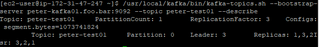
  * kafka-dump-log.sh --print-data-log --files ${세그먼트 파일} 을 통해 세그먼트의 시작 오프셋, 메시지 등의 상세 정보를
  아래와 같이 확인할 수 있다.
    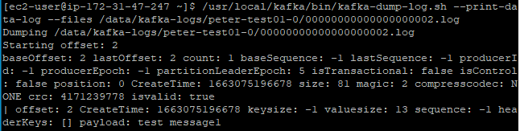
  * N 개의 리플리케이션이 있을 경우, N-1 까지의 브로커 장애시에도 메시지 손실없이 안정적으로 메시지를 주고받을 수 있다

* 리더와 팔로워
  * 각 리플리케이션은 리더와 팔로워로 구분된다. 리더는 한개만 존재하며 프로듀서/컨슈머는 리더에만 데이터를 전송/읽는다
  * 팔로워들은 리더에 문제가 생겼을 경우 리더가 될 준비를 하며, 지속적으로 리더의 변경사항을 반영한다

* 복제 유지와 커밋
  * 리더와 팔로워는 ISR(InSyncReplica) 라는 논리적 그룹으로 묶여 있으며 해당 그룹에 속하는 팔로워만이
  리더가 될 자격을 부여한다
  * 리더는 팔로워들이 특정 주기마다 메시지 요청을 하는지 감시하며, 요청이 오지 않는 팔로워는 ISR 그룹에서 제외시킨다
  (ISR 목록은 토픽 상세보기를 통해 확인가능)
  * 모든 팔로워가 메시지를 복제하면, 리더는 내부적으로 하이워터마크라는 커밋 오프셋을 저장하며, 하이워터마크된 메시지만
  컨슈머에서 읽어갈 수 있다
  * 모든 팔로워가 메시지를 복제하지 않은 상태에서 컨슈머에게 제공하면 아래와 같이 새로운 리더가 선출되었을 경우 데이터
  싱크가 맞지 않는 현상이 발생하게 된다
    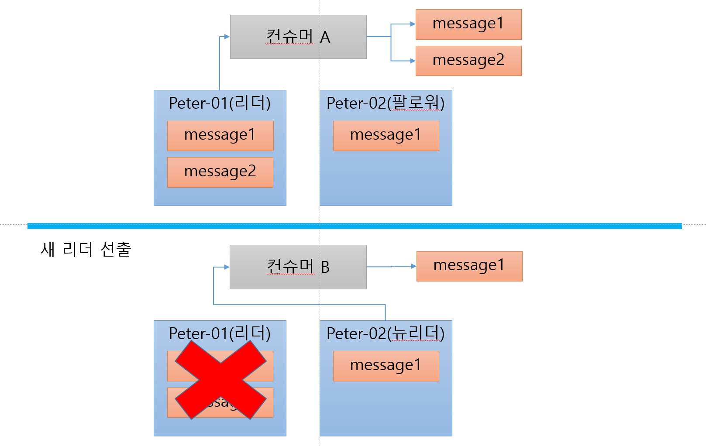
  * 성능 향상을 위해, 리더는 팔로워가 데이터를 잘 저장했는지 여부를 통신 응답으로 확인(ACK) 하지 않으며
  그대신 팔로워가 데이터 요청시 응답에 추가적으로 새로운 메시지가 있다고 알리게 된다
  * /data/kafka-logs/replication-offset-checkpoint 파일에 마지막 오프셋 위치가 아래와 같이 각 브로커에서 저장되게 된다
    > peter-test01 0 6

* 리더와 팔로워의 단계별 리플리케이션 동작
  * 다른 메시지징 큐 시스템과는 다르게, 카프카는 데이터 처리 성능 향상을 위해 팔로워들이 데이터를 잘 저장했는지 확인하는 ACK 통신을 
  하지 않는다
  * 그렇다면 어떻게 안정적으로 데이터를 저장(리플리케이션) 했는지 알 수 있을까?
  * 팔로워들은 리더에게 기본적으로 계속해서 현재 저장된 오프셋 이후의 데이터를 요청한다
  * 리더는 모든 팔로워들에게 특정 오프셋 이후의 데이터 요청이 오면, 오프셋 이전의 데이터는 복제된것으로 간주하고 커밋(하이 워터마크) 처리한다
  * 수행 과정을 정리하면 아래와 같다
    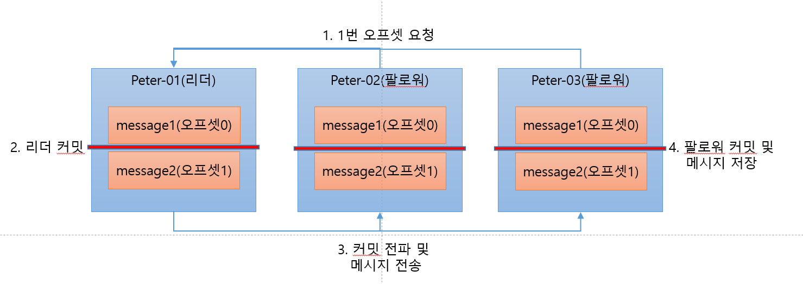

* 리더에포크와 복구
  * 파티션들의 복구 동작 시 메시지 일관성을 위해서 리더에포크라는 것이 존재한다
  * 하이워터마크가 있음에도 리더에포크가 존재하는 이유는 무엇인가? 브로커 장애 복구 특정 상황에서 메시지가 유실될 수 있기 때문, 아래는 리더에포크를 
  사용하지 않았을 때의 유실 시나리오이다
  * 아래 그림과 같은 상태에서 팔로워에서 오프셋2를 요청 -> 리더의 하이워터마크 증가 -> 팔로워에서 하이워터마크 증가 미반영 상태일 경우
    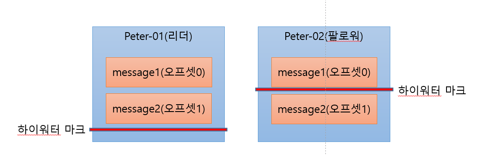
  * 해당 상태에서 팔로워가 장애 발생, 장애복구 시 자신의 하이워터마크 이상의 메시지는 삭제한다
    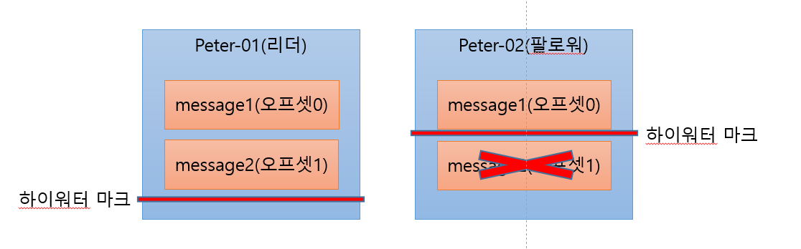
  * 팔로워는 리더에게 오프셋 1에대한 메시지 요청을 보낼 때 리더가 장애가 발생하여 팔로워가 리더로 승격한다, message2 는 유실된다
    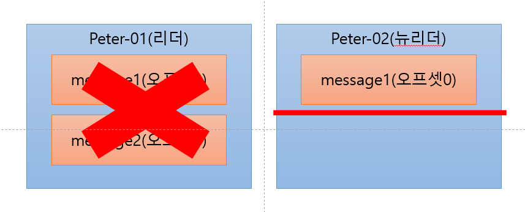
  * 그렇다면 리더에포크를 사용하면 어떻게 될까? 위의 팔로워 장애복구 그림에서 다시 시작하면, 팔로워의 장애가 복구되었을 경우 자신의 하이워터마크보다
  높은 메시지를 삭제하는 것이 아니라 리더에게 리더에포크 요청을 보낸다.
    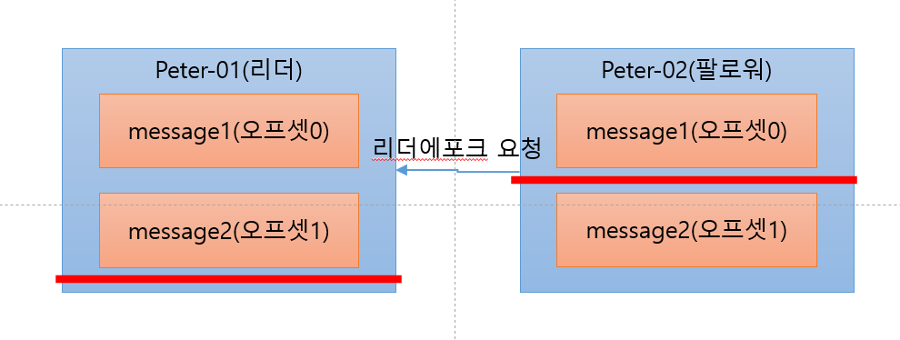
  * 리더에포크 응답에 따라, 팔로워는 1번오프셋까지 하이워터마크를 신뢰할 수 있다고 판단, 자신의 하이워터마크를 오프셋1로 올린다
    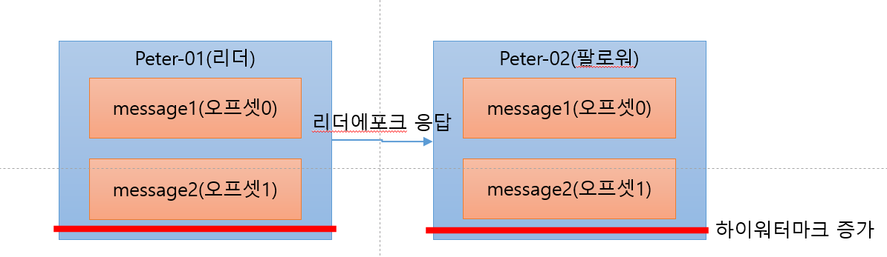
  * 리더에포크를 통해서 위와같이 메시지의 삭제 없이 정상적으로 복구할 수 있다
  * 리더에포크는 각 브로커별로 /data/kafka-logs/{토픽명}-{파티션번호}/leader-epoch-checkpoint 파일에 저장되며 리더가 바뀔 때마다 갱신된다
  * 리더 에포크 파일의 샘플은 아래와 같으며, 각 리더에포크마다 오프셋의 최종 커밋 후 오프셋 번호가 기록되어 있다
  > 0 2 (현재 리더에포크 번호) 0 0 (리더에포크 번호, 오프셋 번호) 1 1 (리더에포크 번호, 오프셋 번호)
  * 해당 파일을 통해, 리더에포크가 1인 시점에서 장애가 발생하고 복구된 브로커는 오프셋 0번까지는 데이터를 보존하고, 오프셋 1번부터 리더에 요청하여 메시지를 받게 된다
  * 리더 에포크 파일의 정합성은 누가 보장해주는지?

* 컨트롤러
  * 파티션의 ISR 리스트에서 리더를 선출하는 부분을 담당. 새로운 리더의 정보를 주키퍼에 기록 및 모든 브로커에게 전달한다
  * 리더가 없는 상태에서는 제대로 된 동작이 불가하므로 빠른 리더의 선출이 중요한 부분이다
  * 예기치 못한 브로커 장애 시, 파티션의 리더가 선출되는 과정은 아래 그림과 같다
    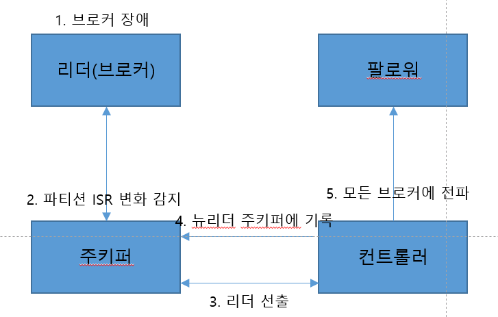
  * 브로커 정상 종료 시, 리더가 선출되는 과정은 아래 그림과 같다
    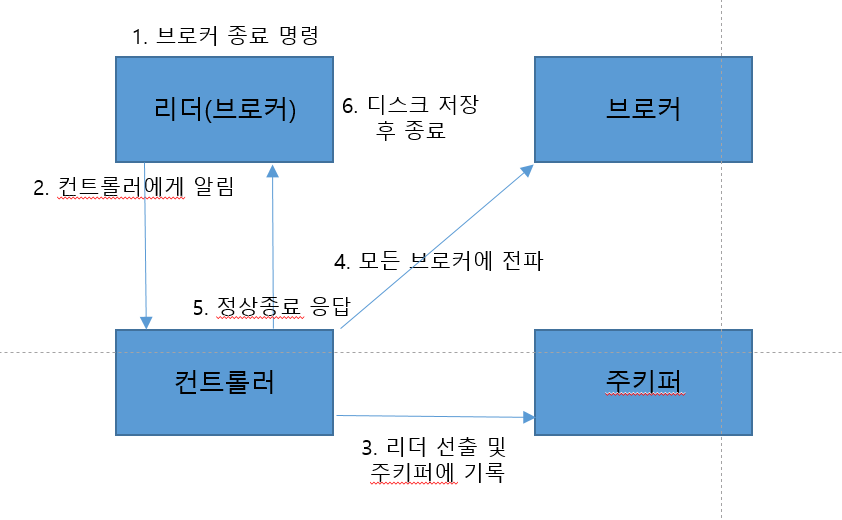
  * 정상 종료 <-> 장애 종료의 차이는 종료 전, 컨트롤러에서 리더 선출을 먼저 하기 때문에 다운타임을 최소화 할 수 있다
  * 브로커에 제어된 종료를 사용하려면, /usr/local/kafka/config/server.properties 에 controlled.shutdown.enable=true 옵션이 적용되어야 한다
  * /usr/local/kafka/bin/kafka-configs.sh --bootstrap-server peter-kafka01.foo.bar:9092 --broker 1 --describe --all | grep controlled.shutdown.enable 명령어를 통해 아래와 같이 확인할 수도 있다
  
    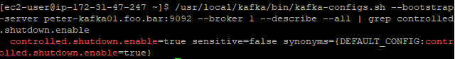

* 로그(로그 세그먼트)
  * 카프카의 토픽으로 들어오는 메시지는 메시지의 메타 정보를 포함해 세그먼트라는 파일에 저장되며 파일의 최대 크기는 1GB 이며 롤링 전략을 취하고 있다
  * 롤링 되더라도, 하드디스크의 용량은 무한하지 않기 때문에 로그 세그먼트에 대한 관리 전략이 필요하다
  * 관리 전략은 세그먼트삭제, 컴팩션으로 구분할 수 있다

* 로그 세그먼트 삭제
  * /usr/local/kafka/config/server.properties 설정파일에 log.cleanup.policy=delete 로 설정되어야 하며, 기본값으로 적용된다
  * peter-test03 토픽 생성 후, 프로듀서를 통해 log1 메시지를 전송 -> 컨슈머로 가져옴 -> retention.ms 옵션을 0으로 조정하여 5분(삭제주기)뒤 로그 파일의 변화를 확인하면 아래와 같다
  * 삭제 전
  
    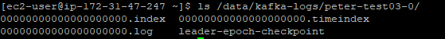
  * 삭제 후(기존 로그 파일이 없어짐)
  
    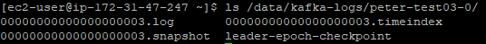
  
* 로그 세그먼트 컴팩션
  * 컴팩션은 로그를 키의 마지막 값만 남겨서 저장하는 방식이다. 이 방식은 프로듀서에서 보낸 메시지의 키를 기준으로 삼기 때문에 프로듀서에서 무조건 키 값을 세팅해야 한다
  * 동작 방식은 아래 그림과 같으며, 데이터의 마지막 값만 남기므로 복구 시 빠른 처리속도를 가질 수 있으나 중간의 값이 필요한 상황에서는 사용하지 않아야 한다
  
    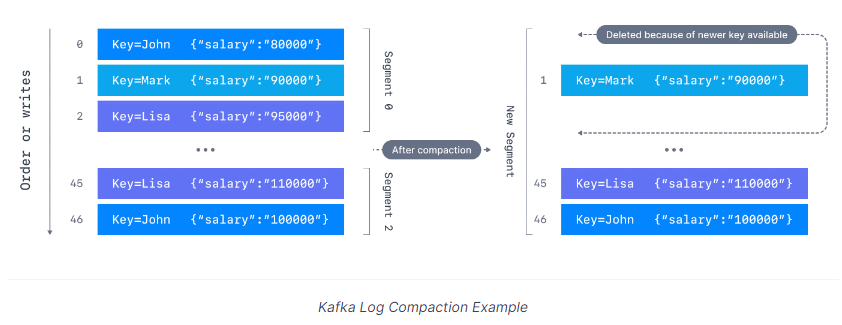