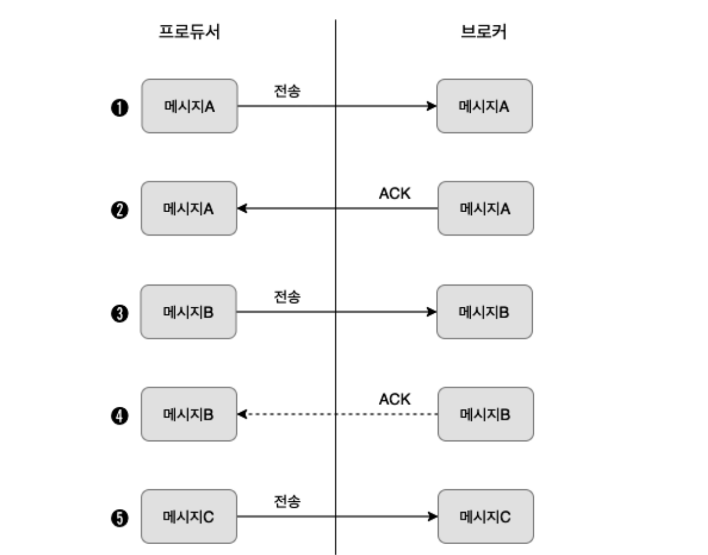
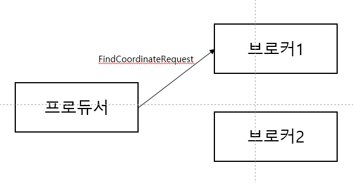

## 5장(프로듀서의 내부 동작 원리와 구현)

* 파티셔너
  * 한개의 토픽은 성능을 위해 한개 이상의 파티션으로 분할되어 저장된다
  * 메시지의 키 값을 기준으로 해싱되어 어느 파티션으로 보낼 지 결정되기 때문에
  나중에 파티션을 추가하면 같은 키 값이라도 다른 파티션에 저장될 수 있다

* 라운드 로빈 전략
  * 메시지의 키 값은 필수가 아니므로, 키 값이 없을 경우 라운드 로빈 방식으로 파티션에 분할한다
  * 라운드 로빈 방식의 문제점은, 프로듀서 내부적으로 카프카에 보낼 때 메시지를 파티션 단위로 배치 처리 하는데
  파티션과 배치 사이즈가 클 경우 충분한 메시지에도 배치 사이즈를 채우지 못해서 전송을 못하는 경우가 생김
  * 해당 부분을 보완하기 위해 스티키 파티셔닝 전략이 개발되었다
  
* 스티키 파티셔닝 전략
  * 라운드 로빈의 단점을 보완하기 위해, 프로듀서에서 특정 파티션의 배치를 먼저 채워서 전송하는 방식
  
  
* 프로듀서 옵션들
  * buffer.memory : 카프카로 메시지들을 전송하기 위해 담아두는 버퍼 메모리
  * batch.size : 배치 전송을 위해 메시지들을 묶는 단위, 기본 16KB
  * linger.ms : 배치 전송을 위해 버퍼 메모리에서 대기하는 시간, 기본 0ms

* 프로듀서 메시지 전송 방식 종류
  * 적어도 한 번 전송
  * 최대 한 번 전송
  * 정확히 한 번 전송

* 적어도 한 번 전송
  * 최소 한번 이상의 전송이 보장되는 방식이며 아래 그림과 같이 동작한다.
  
  * 흐름을 정리하면, 전송 후 ACK 를 받지 못하면 계속 재 전송하는 동작이다
  * 브로커에서 메시지를 받았으나, 네트워크 등의 문제로 ACK 를 프로듀서에서 못 받고 재전송할 수 있기 때문에 최소 한번 이상 동작이다
* 최대 한 번 전송
  * 최대로 한 번 전송이 보장되는 방식이며 아래 그림과 같이 동작한다.
  
  * 흐름을 정리하면, ACK 응답을 받지 못하여도 계속해서 다음 메시지를 전송한다
  * 해당 방식에서는 사실 ACK 가 필요하지 않으며, 데이터 유실을 감안하더라도 처리량이 중요한 대량의 로그
  데이터 저장 시 사용한다
* 중복 없는 전송(멱등성 전송)
  * 프로듀서의 메시지를 중복 없이 전송이 보장되는 방식이다
  * 멱등성이란? 
    * 동일한 작업을 여러번 수행하더라도, 결과가 달라지지 않는 것을 의미
    * 카프카에서는 프로듀서를 통해 동일한 메시지를 중복 전송하더라도 카프카에는 한번만 저장되는 것을 의미
  * 아래 그림과 같이 동작한다
  
  * 흐름을 정리하면, 프로듀서는 메시지의 헤더에 PID(producer id) 와 메시지의 시퀀스를 전송하며
  브로커는 받은 메시지의 PID 와 시퀀스를 메모리에 저장하고 있다. 미처 브로커에서 ACK 응답을 보내지 못했더라도
  프로듀서에서 재전송하는 PID 와 시퀀스 값을 비교하여 이미 저장된 메시지면 저장하지 않고 ACK 응답만을 보낸다
  * 해당 전송 방식에는 PID, 시퀀스를 확인하므로 오버헤드가 있다, 하지만 생각보다 높은 편은 아니다(-20%)

* 정확히 한 번 전송
  * 카프카에서 정확히 한 번 전송은, 트랜잭션과 같은 전체적인 프로듀서 프로세스를 의미함
  * 트랜잭션 내에서 프로듀서 메시지 전송 방식은 어느 걸로 채택해도 됨(하위 개념)
  * 카프카 내에 트랜잭션을 관리하는 프로세스가 따로 존재하며 이를 트랜잭션 API 라 칭함
  > 트랜잭션 : 논리적인 연속된 작업 단위, 하나라도 실패하는 경우 해당 작업 단위가 실패 처리됨
  * 프로듀서의 트랜잭션을 지원하기 위해 서버 내부적으로 트랜잭션 코디네이터가 존재하며, 트랜잭션
  로그를 _transaction_state 토픽에 저장한다
  * _transaction_state 토픽은 트랜잭션 코디네이터가 알아서 담당하여 트랜잭션 내역을 기록한다
  * 트랜잭션이 커밋되기 전에 메시지는 브로커에 계속 쌓이고 있는데, 트랜잭션이 커밋되었는지 어떻게 판단할까? 
  이를 식별하기 위해 컨트롤 메시지라는 개념이 사용된다
  * 정확히 한번 전송(트랜잭션) 예제 코드는 아래와 같다
    ```java
  
        import org.apache.kafka.clients.producer.*;
        import org.apache.kafka.common.serialization.StringSerializer;
      
        import java.util.Properties;
      
        public class ExactlyOnceProducer {
        public static void main(String[] args) {
        String bootstrapServers = "peter-kafka01.foo.bar:9092";
        Properties props = new Properties();
        props.setProperty(ProducerConfig.BOOTSTRAP_SERVERS_CONFIG, bootstrapServers);
        props.setProperty(ProducerConfig.KEY_SERIALIZER_CLASS_CONFIG, StringSerializer.class.getName());
        props.setProperty(ProducerConfig.VALUE_SERIALIZER_CLASS_CONFIG, StringSerializer.class.getName());
        props.setProperty(ProducerConfig.ENABLE_IDEMPOTENCE_CONFIG, "true"); // 정확히 한번 전송을 위한 설정
        props.setProperty(ProducerConfig.ACKS_CONFIG, "all"); // 정확히 한번 전송을 위한 설정
        props.setProperty(ProducerConfig.MAX_IN_FLIGHT_REQUESTS_PER_CONNECTION, "5"); // 정확히 한번 전송을 위한 설정
        props.setProperty(ProducerConfig.RETRIES_CONFIG, "5"); // 정확히 한번 전송을 위한 설정
        props.setProperty(ProducerConfig.TRANSACTIONAL_ID_CONFIG, "peter-transaction-01"); // 정확히 한번 전송을 위한 설정
      
                Producer<String, String> producer = new KafkaProducer<>(props);
      
                producer.initTransactions(); // 프로듀서 트랜잭션 초기화
                producer.beginTransaction(); // 프로듀서 트랜잭션 시작
                try {
                    for (int i = 0; i < 1; i++) {
                        ProducerRecord<String, String> record = new ProducerRecord<>("peter-test05", "Apache Kafka is a distributed streaming platform - " + i);
                        producer.send(record);
                        producer.flush();
                        System.out.println("Message sent successfully");
                    }
                } catch (Exception e){
                    producer.abortTransaction(); // 프로듀서 트랜잭션 중단
                    e.printStackTrace();
                } finally {
                    producer.commitTransaction(); // 프로듀서 트랜잭션 커밋
                    producer.close();
                }
            }
        }
    
      ```
* 정확히 한 번 전송 단계별 동작
  1. 트랜잭션 코디네이터 찾기
    * 프로듀서에서 FindCoordinatorRequest 메시지를 보내서, 트랜잭션 코디네이터를 생성하거나 어느 브로커에 있는지 찾는다
    * _transaction_state(트랜잭션 상태 기록 토픽) 은 프로듀서에서 보낸 TRANSACTIONAL_ID 를 기반으로 해시하여 파티션을 정하며, 
    이 파티션의 리더 브로커에 코디네이터가 존재하게 된다
         
  2. 프로듀서 초기화
    * 프로듀서에서 initTransactions() 메서드를 통해 InitPidRequest 를 브로커로 보낸다.
      (코디네이터 찾는 부분은 그럼 프로듀서 생성시?)
    * 요청을 받은 트랜잭션 코디네이터에서는 PID(프로듀서 아이디) 와 TID(트랜잭션의 아이디)를 매핑해서 해당 정보를 트랜잭션 로그에 기록한다
    * PID 에포크를 올리며, 해당 에포크 이전의 PID 와 이전 에포크에 대한 쓰기 요청은 무시된다(리더에포크와 유사함)
    
     
  3. 트랜잭션 시작
    * 프로듀서의 beginTransaction() 메서드를 통해 프로듀서 내부에서 트랜잭션이 시작됨을 알림
    * 트랜잭션 코디네이터에는 영향 없음
    
  
  4. 트랜잭션 상태 추가
    * 프로듀서는 토픽의 파티션 정보를 트랜잭션 코디네이터에게 전달(파티션 0)
    * 코디네이터는 해당 정보를 OnGoing 상태로 로그에 기록
    * 첫번째 기록되는 파티션이라면, 타이머를 설정해서 해당시간(기본 1분)동안 상태 업데이트가 없다면 트랜잭션 실패
    
  5. 메시지 전송
    * 프로듀서는 이제 대상 토픽의 파티션으로 메시지를 전송한다
    * 해당 메시지에는 PID, 에포크, 시퀀스 번호가 포함되어 있다
    * 코디네이터와 메시지를 전송받는 브로커 서버는 서로 다르다 (서버가 한개일 때는 한 서버에서 동작?)
    
  6. 트랜잭션 종료 요청
     * 메시지 전송을 완료한 프로듀서는 abortTransaction() or commitTransaction() 를 무조건 호출해야 한다
     * 위의 메서드 호출을 통해 트랜잭션이 종료되었음을 코디네이터에게 알린다
     * 이에 코디네이터는 첫 커밋 과정을 수행하게 되며 abortTransaction() -> PrepareAbort, commitTransaction() -> PrepareCommit
     을 트랜잭션 로그에 기록한다
     
  7. 사용자 토픽에 표시 요청
     * 코디네이터는 두번째 커밋 과정을 수행하게 된다, 이 과정은 토픽 파티션에 트랜잭션 커밋 메시지(컨트롤 메시지)를 기록하는 것이다
     * 따라서 메시지를 하나만 보냈더라도, 오프셋은 컨트롤 메시지까지 2개가 된다
     * 트랜잭션이 끝나지 않는 메시지는 오프셋의 순서 보장을 위해 트랜잭션 성공 또는 실패를 나타내는 LSO 오프셋을 유지한다
     * 트랜잭션이 끝나지 않은 메시지는 컨슈머에게 전송되지 않는다. 
     
  
  8. 트랜잭션 완료
    * 트랜잭션 코디네이터는 committed 라고 트랜잭션 로그에 기록한다. 또한 프로듀서에게 트랜잭션이 끝났음을 알린다
    * 트랜잭션을 이용하는 컨슈머는 read_committed 설정을 하면 트랜잭션에 성공한 메시지들만 읽을 수 있게 된다
    