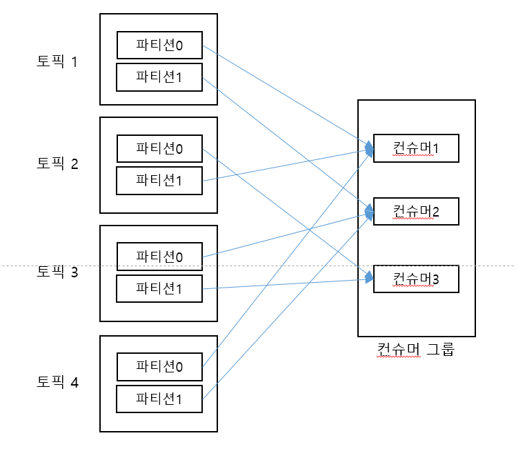

## 6장(컨슈머의 내부 동작 원리와 구현)

* 컨슈머 오프셋 관리
  * 컨슈머 그룹은 읽어온 메시지의 오프셋 및 컨슈머 그룹, 토픽, 파티션 등의 정보를  __consumer_offsets 토픽에 저장한다 
  * 토픽에 저장되는 오프셋은 저장할 때, 컨슈머가 읽은 오프셋이 아니라 다음에 읽어올 오프셋을 저장한다

* 그룹 코디네이터
  * 컨슈머 그룹 내의 컨슈머들은 언제든지 추가되고 삭제될 수 있다. 이럴때마다 컨슈머 그룹은 각 컨슈머들에게 작업을 균등하게 분배해야 하며 이 작업을
  리밸런싱 이라고 한다
  * 트랜잭션 코디네이터처럼, 컨슈머 그룹의 안정적인 관리를 위해 코디네이터가 존재하며 이를 그룹 코디네이터라고 한다
  * 그룹 코디네이터는 브로커 중 하나에 위치하며, 구독한 토픽의 파티션들과 그에 대한 컨슈머 그룹을 트래킹해서, 변경 시 컨슈머 리밸런싱 동작을 발생시킨다
  * 컨슈머 그룹과 코디네이터의 상호 작용은 아래 그림과 같다
  
  * 컨슈머 그룹 내의 컨슈머들의 변경을 감지하기 위해서 그룹 코디네이터와 컨슈머들은 주기적으로 서로 하트비트를 주고 받으며 이는 설정을 통해 간격을 조정할 수 있다
  * 컨슈머 리밸런싱 동작은 비용이 크므로, 리밸런싱을 최소화 하는 방향으로 설정되어야 한다. 특정한 경우가 아닌 이상 기본값 설정이 권장된다
  
* 스태틱 멤버십
  * 컨슈머 리밸런싱 동작은 비용이 크다고 했는데, 설정 변경이나 컨슈머 재기동이 필요한 경우에는 리밸런싱이 일어나게 된다. 이 비용을 없애기 위해서 
  카프카 2.3 버전부터 스태틱 멤버십 이라는 개념이 도입되었다
  * 스태틱 멤버십이란, 컨슈머마다 구별할 수 있는 ID를 적용함으로써 그룹 내에서 컨슈머가 재시작 등으로 그룹에서 나갔다가 다시 합류하더라도 
  리밸런싱이 일어나지 않게 한다
  * 컨슈머 인스턴스 별로 group.instance.id 를 적용하면, 스태틱 멤버십을 사용할 수 있다
  * session.timeout.ms 에 지정된 값 이상으로 컨슈머가 다시 시작되지 않으면, 스태틱 멤버십을 적용하였더라도 리밸런싱이 일어나니 설정 시간을 잘
  고려해야 한다
  * peter-topic06 을 생성 후(리플리케이션 팩터 3, 파티션 3) 3개의 인스턴스에서 컨슈머를 실행하고
    /usr/local/kafka/bin/kafka-consumer-groups.sh --bootstrap-server peter-kafka01.foo.bar:9092 --group peter-consumer01 --describe 명령어를 통해
  컨슈머의 매핑 상태를 확인하면 각 서버(인스턴스)별로 파티션이 매핑된 것을 확인할 수 있다
  
  
  * 한 컨슈머를 종료한 뒤에 확인해보면, 아래와 같이 종료된 컨슈머는 제외되고 리밸런싱이 일어난 것을 확인할 수 있다
  
  
  * 스태틱 멤버십을 사용할 경우에도, session.timeout.ms 만큼 이상이 지나면 위와 같이 리밸런싱이 일어난다
  * 그럼 스태틱 멤버십을 통해 컨슈머가 유지되는 동안은 읽을 수 없는것인가?

* 컨슈머 파티션 할당 전략
  * 프로듀서 파티셔너와 비슷하게 컨슈머 그룹의 리더 컨슈머는 특정 토픽의 특정 파티션을 어떤 컨슈머에게 할당할지 결정하는데
  이를 결정하는 파티션 할당 전략을 설정할 수 있다
  * 파티션 할당 전략은 partition.assignment.strategy 로 표시하며 아래와 같은 파티션 전략들을 할당할 수 있다
    1. 레인지 전략
    2. 라운르 로빈 전략
    3. 스티키 전략
    4. 협력적 스티키 전략
  
* 레인지 파티션 할당 전략
  * 파티션 할당 전략 중 기본 전략으로써 각 토픽별로 할당 전략을 사용한다
  * 토픽 내의 파티션들을 나열한 뒤에, 각 파티션 들을 컨슈머 개수로 나누어 균등하게 할당한다. 딱 떨어지지 않을 경우 앞의 컨슈머가 파티션을 더 할당받게 된다
  
  * 불균형하게 할당될 수 있는 이 전략의 사용 이유는 무엇일까? 여러 토픽의 파티션 0번들에게 같은 키값을 가진 메시지가 저장되는 상황일 때 해당 전략을 사용하면
  모든 파티션 0번들은 1번 컨슈머에 할당되기 때문에 결과적으로 같은 키값을 가진 메시지가 모두 하나의 컨슈머에서 컨슘되게 하고 싶을 때 사용한다
  * 같은 키 값을 가진 메시지가 모두 하나의 컨슈머에서 사용되면, 어떤 부분이 좋은건지?

* 라운드 로빈 파티션 할당 전략
  * 모든 파티션과 컨슈머 그룹 내 모든 컨슈머를 나열한 후 라운드 로빈으로 할당하는 전략
   
  
* 스티키 파티션 할당 전략
  * 레인지, 라운드 로빈은 컨슈머 그룹 리밸런싱 동작 시 원래 매칭됐던 파티션<->컨슈머 매핑이 보장되지 않음. 최대한 기존 매핑을 보장하기 위한 전략
  * 스티키 파티션 전략은 아래와 같은 규칙을 따른다
    * 컨슈머들의 최대 할당된 파티션의 수의 차이는 1
    * 기존의 존재하는 파티션 할당은 최대한 유지
    * 재할당 동작 시 유효하지 않은 모든 파티션 할당은 제거
    * 미할당된 파티션은 균형을 맞추는 방향으로 컨슈머에게 할당
  * 최초 스티키 파티션 할당 전략은 아래와 같이 라운드 로빈과 동일하다
   
  
  * 해당 상황에서 컨슈머2가 제외됐을 경우, 규칙에 따라 아래와 같은 결과로 동작한다
   

* 협력적 스티키 파티션 할당 전략
  * 위의 스티키 파티션 할당 전략과 동일한 방식이나, 컨슈머 그룹 내부의 리밸런싱 동작이 고도화된 전략
  * 기존의 모든 컨슈머 리밸런싱 동작 프로토콜(EAGER) 는, 모든 파티션 <-> 컨슈머 매핑을 제거한 후 리밸런싱 작업을 수행하며 그 이유는 아래와 같다
    * 특정 컨슈머에 매핑되어있는 1번 파티션을 다른 컨슈머에 매핑 시키는 경우, 잠시동안 1번 파티션은 컨슈머 2개가 소유하게 되므로 컨슈머 그룹 정책에 어긋남
    * 그룹 내에서 많은 파티션들에 대해 소유권 변경작업이 일어나야 하므로, 로직의 단순화를 위해
  * 이렇게 모든 파티션 할당을 취소하는 상황에서는 컨슈머들의 다운타임이 증가하게 된다
  * 해당 부분을 보완(다운타임을 최소화) 하기위해서, 여러번 리밸런싱이 일어나도 좋으니 다운타임을 최소화하는 정책을 가지고 만들어진 프로토콜이 COOPERATIVE(협력) 이다
  * 동작 방식
    * 리밸런싱 동작 시 컨슈머<->파티션 매핑 정보를 우선적으로 그룹 코디네이터에게 전송
    * 그룹 코디네이터는 정보를 조합해 다시 컨슈머 리더에게 전송
    * 컨슈머 리더는 해당 정보를 통해 새 파티션 정보를 컨슈머들에게 알린다(1차 리밸런싱)
    * 컨슈머들은 새 파티션 정보 <-> 현재 파티션 정보를 비교해서 제거해야 할 파티션들만 제거한다(1차 리밸런싱 끝)
    * 제외된 파티션 할당을 위해 컨슈머들이 다시 합류 요청을 하여 두번째 리밸런싱을 트리거(2차 리밸런싱)
    * 제외된 파티션을 적절한 컨슈머에게 할당(2차 리밸런싱 끝)
  * 해당 방식은 카프카 3.0 버전부터 파티션 할당 전략의 기본값으로 채택될 확률이 높음

* 정확히 한 번 컨슈머 동작
  * 이전의 프로듀서의 '정확히 한 번 전송' 을 통해 트랜잭션이 완료되면 트랜잭션 성공을 뜻하는 특수한 메시지가 기록되었음
  * 컨슈머는 이에 따라 특수한 메시지를 표시한 레코드만 읽는다면, 정확히 한 번 읽을 수 있음
  * 정확히 한번 읽기 위한 설정이 들어간 컨슈머 소스 코드 예제는 아래와 같다
  
  ~~~java
  import org.apache.kafka.clients.consumer.ConsumerConfig;
  import org.apache.kafka.clients.consumer.ConsumerRecord;
  import org.apache.kafka.clients.consumer.ConsumerRecords;
  import org.apache.kafka.clients.consumer.KafkaConsumer;
  import org.apache.kafka.clients.producer.ProducerConfig;
  import org.apache.kafka.common.serialization.StringDeserializer;
  
  import java.util.Arrays;
  import java.util.Properties;
  
  public class ExactlyOnceConsumer {
  public static void main(String[] args) {
  String bootstrapServers = "peter-kafka01.foo.bar:9092";
  Properties props = new Properties();
  props.setProperty(ProducerConfig.BOOTSTRAP_SERVERS_CONFIG, bootstrapServers);
  props.setProperty(ConsumerConfig.KEY_DESERIALIZER_CLASS_CONFIG, StringDeserializer.class.getName());
  props.setProperty(ConsumerConfig.VALUE_DESERIALIZER_CLASS_CONFIG, StringDeserializer.class.getName());
  props.setProperty(ConsumerConfig.GROUP_ID_CONFIG, "peter-consumer-01");
  props.setProperty(ConsumerConfig.AUTO_OFFSET_RESET_CONFIG, "earliest");
  props.setProperty(ConsumerConfig.ENABLE_AUTO_COMMIT_CONFIG, "false");
  props.setProperty(ConsumerConfig.ISOLATION_LEVEL_CONFIG, "read_committed"); // 정확히 한번 전송을 위한 설정
  
          KafkaConsumer<String, String> consumer = new KafkaConsumer<>(props);
          consumer.subscribe(Arrays.asList("peter-test05"));
  
          try {
              while (true) {
                  ConsumerRecords<String, String> records = consumer.poll(1000);
                  for (ConsumerRecord<String, String> record : records) {
                      System.out.printf("Topic: %s, Partition: %s, Offset: %d, Key: %s, Value: %s\n",
                              record.topic(), record.partition(), record.offset(), record.key(), record.value());
                  }
                  consumer.commitAsync();
              }
          } catch (Exception e) {
              e.printStackTrace();
          } finally {
              consumer.close();
          }
      }
  }
  ~~~
  * ISOLATION_LEVEL_CONFIG 설정을 통해 커밋된 메시지만 읽어올지 아닐지 여부를 설정할 수 있다
  * 해당 설정을 통해 커밋된 메시지만 읽어오더라도, 컨슈머는 정확히 한번 가져오는 것을 보장할 수 없다.
  (커밋된 메시지를 가져오더라도, 오프셋이 증가 처리가 되지 않은 상태에서 컨슈머가 다시 시작되면 다시 읽어올 수도 있는 것으로 생각됨)
  * 컨슈머의 동작까지 정확히 한번 처리하려면, sendOffsetsToTransaction 메서드를 이용해 컨슈머 그룹의 오프셋 커밋을 트랜잭션에 포함시키고, 실패 시 
  오프셋을 증가시키지 않게 하면 가능하다
  * 일부 기 구현된 컨슈머 애플리케이션에는 정확히 한번을 지원하는 경우도 있으므로 잘 판단하여 사용하여야 함