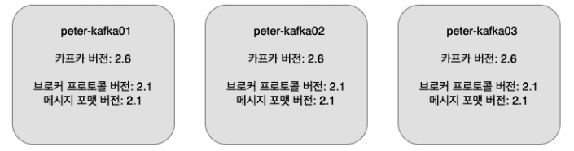
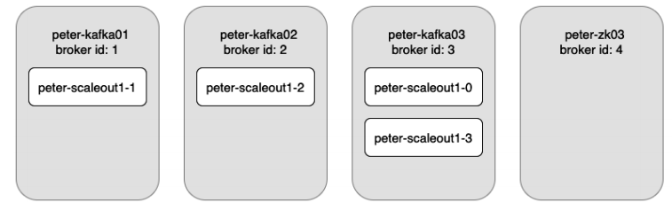

## 8장(카프카 버전 업그레이드와 확장)

* 카프카 버전업그레이드
  * 카프카의 최신 버전이 나올떄마다 버전 업그레이드 하기는 쉽지 않다, 하지만 보안 취약점이나 최신 기능을 사용하여야 할 경우에는 업그레이드가 필요하다
  * kafka-topics.sh 를 통하거나 ${kafka-설치 디렉토리}/libs 하위의 lib jar 를 통해서 현재 카프카의 버전을 확인할 수 있다
  * 기본적으로는 버전업 시 하위호환성을 만족하나 종료된 기능들도 있기 떄문에 릴리즈 노트를 업데이트 전 확인해야 한다
  * 카프카의 업그레이드 방식은 다운타임이 있는 업그레이드 <-> 다운타임 없는 업그레이드로 나뉜다
  * 다운타임이 있는 업그레이드는 단순 종료 뒤 최신버전의 카프카를 실행하면 된다. 하지만 일반적으로 장애 최소화를 위해 다운타임 없는 업그레이드가 필요하다.

* 카프카 롤링 업그레이드
  * 다운타임이 없이 업그레이드 하기 위해 브로커 서버 한대씩 돌아가며 업그레이드 하는 방식
  * 아래와 같은 순서로 업그레이드 된다
    1. 최신 버전의 카프카를 다운로드하여 특정 디렉토리에 위치시킨다
    2. 현재 운영중인 브로커의 설정 파일을 새로운 버전에 복사한다
    3. 새로운 버전의 설정 파일에 아래항목을 추가하여 현재 운영중인 메시지 프로토콜을 사용하도록 설정한다
       * inter.broker.protocol.version={version}  
       * log.message.format.version={version}
    4. 브로커 한대씩 순차적으로 종료한 뒤 kafka 의 심볼릭 링크를 새로 설치한 버전으로 변경한 뒤 재기동한다. 모든 브로커 패치후, 아래와 같은 상태가 된다
       
    5. 설정에서 메시지 프로토콜 설정을 지운 뒤, 다시 각각 브로커를 재기동한다

    
* 업그레이드 주의사항
  * 운영서버에 바로 패치하는것 보다는, 개발 서버에서 먼저 패치를 해보는 것이 좋다
  * 사용량이 적은 시간대에 패치하는 것이 좋다. 그 이유는 브로커가 종료, 시작되면서 리더가 새로 선출되고 팔로워들이 뉴리더와 싱크를 맞추는 동작이 수행되면서 부하가 생기기 떄문
  * ack = 1 옵션을 사용할 경우, 메시지가 유실될 수 있다(?)

  
* 카프카의 확장
  * 나중에 메시지 사용량이 늘어서, 카프카를 확장하고 싶을 경우가 있다
  * 새로운 서버에 카프카를 설치하고 server.properties 파일의 broker.id 를 겹치지 않게 증가시켜 실행하면 새로운 브로커 서버가 추가되게 되며 아래 그림과 같다
    
  * 토픽의 파티션들은 자동으로 분배되지 않으며 수동으로 재분배 시켜줘야 한다. kafka-reassign-partitions.sh 쉘을 통해 쉽게 파티션을 이동 시킬 수 있다
  * 또한 해당 쉘에서 특정 토픽에 대해 제안되는 파티션 배치를 확인할 수도 있고, 브로커 별로 파티션의 분배를 적용시킬 수도 있다
  * 새로운 서버가 추가된 이후로 생성되는 토픽은 자동으로 모든 서버에 파티션이 잘 분배되지만, 기존 토픽들을 위에서 설명한 쉘을 통해 고르게 분배하면 좀더 효율적인 운영이 가능하다
  * 파티션 재분배 작업은 유의하여야 할 점이, 파티션이 다른 브로커로 이동할 때는 리플리케이션을 통해 복제되고 사라지는 것이므로 큰 파티션이라면 부하가 클 수 있다
  * 최대한 데이터 로그 보관 기간을 줄이고, 한 번에 한 토픽씩만 파티션 분배 작업을 진행하면 좋다
  
