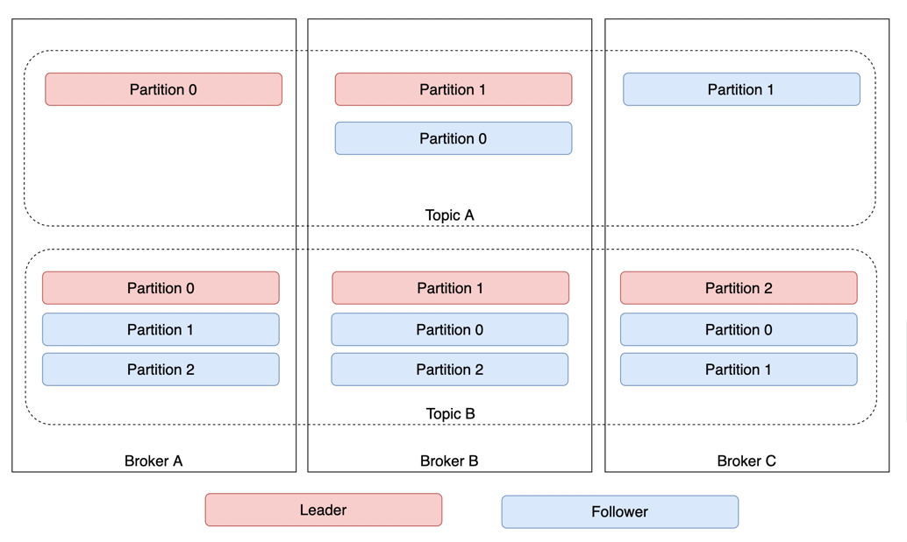
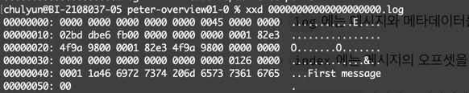
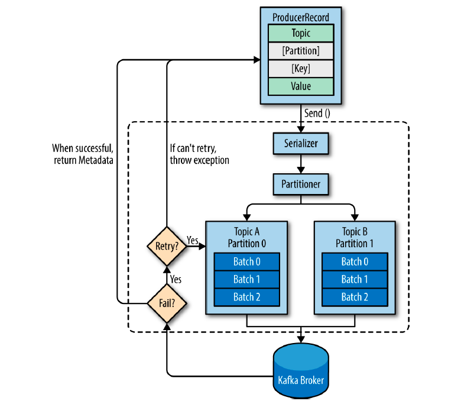

# Chapter 3. 카프카 기본 개념과 구조

## 카프카 기초 다지기
* 카프카 구성 요소
  * 주키퍼: 카프카의 메타데이터 관리 및 브로커의 정상상태 점검을 담당한다.
  * 카프카 클러스터: 여러 대의 브로커를 구성한 클러스터를 의미한다.
  * 브로커: 카프카가 설치된 서버 또는 노드를 의미한다.
  * 프로듀서: 카프카로 메시지를 보내는 역할을 하는 클라이언트를 의미한다.
  * 컨슈머: 카프카에서 메시지를 꺼내서 소비하는 역할을 하는 클라이언트를 의미한다.
  * 토픽: 카프카는 메시지 피드들을 토픽으로 구분하고, 각 토픽의 이름은 카프카 내에서 고유하다.
  * 파티션: 병렬 처리 및 고성능을 얻기 위해 하나의 토픽을 여러 개로 나눈 것을 말한다.
  * 세그먼트: 프로듀서가 전송한 실제 메시지가 브로커의 로컬 디스크에 저장되는 파일을 말한다.
  * 메시지 or 레코드: 프로듀서가 브로커로 전송하거나 컨슈머가 읽어가는 데이터 조각을 말한다.

### 리플리케이션 (Replication)

* 리플리케이션이란 각 메시지들을 카프카 클러스터 내 브로커들에 복제하여 분산시키는 것을 말한다.
* 리플리케이션 덕분에 하나의 브로커가 종료되더라도 카프카는 안정성을 유지할 수 있다.
* 토픽 생성 명령어 중, replication-factor {N}은 카프카 내에 N개의 리플리케이션(원본 포함)을 유지하겠다는 의미다.
* 리플리케이션 팩터 수가 커지면 안정성은 높아지지만 그만큼 브로커 리소스를 많이 사용하게 된다. (복제에 대한 오버헤드와 성능의 트레이드 오프를 고려하여 브로커를 효율적으로 운영해야 한다.)

### 파티션 (Partition)
* 하나의 토픽이 한 번에 처리할 수 있는 한계를 높이기 위해 토픽 하나를 여러 개로 나눠 병렬 처리가 가능하게 만든 것을 파티션이라고 한다.
* 파티션을 여러 개로 나눔으로써 분산 처리가 가능해진다.
* 나누어진 파티션 수만큼 컨슈머를 연결할 수 있다.
* 파티션 수는 초기 생성 후 언제든지 늘릴 수 있지만, 반대로 한 번 늘린 파티션 수는 다시 줄일 수 없다.
  * 따라서 초기에 토픽을 생성할 때는 파티션 수를 작게 생성한 후, 메시지 처리량이나 컨슈머의 LAG 등을 모니터링하면서 조금씩 늘려가는 방법이 좋다.
* 컨슈머의 LAG이란 (프로듀서가 보낸 메시지 수 - 컨슈머가 가져간 메시지 수)를 나타낸다.

### 세그먼트 (Segment)
* 프로듀서에 의해 브로커로 전송된 메시지는 토픽의 파티션에 저장되며, 각 메시지들은 세그먼트라는 로그 파일의 형태로 브로커의 로컬 디스크에 저장된다.
* 각 파티션마다 N개의 세그먼트 로그 파일들이 존재하고, 각 로그 파일들은 {토픽명}-{파티션 번호}라는 이름의 디렉토리에 저장된다.
* 세그먼트는 config/server.properties의 log.dirs 옵션에 정의된 경로에 저장된다.




## 카프카의 핵심 개념

### 분산 시스템
* 분산 시스템은 네트워크상에서 연결된 컴퓨터들의 그룹을 말하며, 단일 시스템이 갖지 못한 높은 성능을 목표로 한다.
* 서버 또는 노드 등에 장애가 발생하더라도 다른 서버 또는 노드가 대신 처리하므로 장애 대응에 탁월하다.
* 부하가 높은 경우에는 시스템 확장에 용이하다.
  * 최초로 구성한 클러스터의 리소스가 한계치에 도달해 더욱 높은 메시지 처리량이 필요한 경우, 브로커를 추가하는 방식으로 확장이 가능하다.
  * 브로커는 온라인 상태에서 간단하게 추가할 수 있다.

### 페이지 캐시
* 운영체제는 성능을 높이기 위해 페이지 캐시를 활용한다.
* 카프카 역시 페이지 캐시를 활용하는 방식으로 설계되어 높은 처리량을 제공한다.
* 페이지 캐시랑 직접 디스크에 읽고 쓰는 대신 물리 메모리 중 애플리케이션이 사용하지 않는 일부 잔여 메모리를 활용한다.
  * 페이지 캐시를 활용하면 디스크에 대한 I/O 접근이 줄어들기 때문에 성능을 높일 수 있다.

### 배치 전송 처리
* 카프카는 프로듀서, 컨슈머 클라이언트들과 서로 통신한다.
* 이때 발생하는 수많은 통신을 묶어서 배치 전송하여 단건으로 통신할 때보다 더 효율적으로 처리한다.

### 압축 전송
* 카프카는 메시지 전송 시 좀 더 성능이 높은 압축 전송을 사용하는 것을 권장한다.
* 카프카에서 지원하는 압축 타입은 gzip, snappy, lz4, zstd 등이 있다.
* 압축을 통해 네트워크 대역폭이나 회선 비용을 줄일 수 있고, 배치 전송과 결합해 사용한다면 더 높은 효과를 얻을 수 있다.
* 일반적으로 높은 압축률이 필요한 경우라면 gzip이나 zstd를 권장하고, 빠른 응답 속도가 필요하다면 lz4나 snappy를 권장한다.
  * 메시지의 형식이나 크기에 따라 또 다른 결과를 나타낼 수 있으니 실제로 메시지를 전송해보면서 압축 타입별로 직접 테스트를 해보고 결정하는 것이 가장 좋다.

### 토픽, 파티션, 오프셋
* 카프카는 토픽이라는 곳에 데이터를 저장한다.
* 토픽은 병렬 처리를 위해 여러 개의 파티션이라는 단위로 나뉜다.
* 파티션의 메시지가 저장되는 위치를 오프셋이라고 한다.
* 오프셋은 각 파티션마다 순차적으로 증가하는 숫자(64비트 정수) 형태로 되어 있다.
  * 각 파티션에서의 오프셋은 고유한 숫자로, 오프셋을 통해 메시지의 순서를 보장하고 컨슈머에서는 마지막까지 읽은 위치를 알 수 있다.

### 고가용성 보장
* 카프카는 분산 시스템이기 때문에 하나의 서버나 노드가 다운되어도 다른 서버 또는 노드가 장애가 발생한 서버의 역할을 대신하여 안정적인 서비스가 가능하다.
* 고가용성 보장을 위해 카프카에서는 리플리케이션 기능을 제공한다.
* 카프카에서 제공하는 리플리케이션은 토픽 자치를 복제하는 것이 아니라, 토픽의 파티션을 복제하는 것이다.
* 토픽을 생성할 때 옵션으로 리플리케이션 팩터 수를 지정할 수 있으며, 이 숫자에 따라 리플리케이션이 존재한다.
  * 원본 파티션을 Leader, 복제 파티션을  Follower라고 부른다.
* 파티션 리더는 1을 유지하고, 팔로워 파티션은 리플리케이션 팩터 수에 따라 증가한다.
* 팔로워 수가 커지면 그만큼 브로커의 디스크의 공간도 소비되므로 이상적인 리플리케이션 팩터 수를 유지하는 것이 중요하다.
* 일반적으로 리플리케이션 팩터 수는 3으로 구성되도록 권장된다.
* 리더는 프로듀서, 컨슈머로부터 오는 모든 읽기와 쓰기 요청을 처리하며, 팔로워는 오직 리더로부터 리플리케이션한다.

### 주키퍼의 의존성
* 주키퍼는 여러 대의 서버를 클러스터로 구성하고, 살아 있는 노드 수가 과반수 이상 유지된다면 지속적인 서비스가 가능한 구조다.
  * 메타데이터를 저장하고 각 브로커를 관리한다.
* 주키퍼는 반드시 홀수로 구성해야 한다.
* 카프카는 주키퍼에 대한 의존성을 제거할 예정이다.

## 프로듀서의 기본 동작

### 프로듀서 디자인

* ProducerRecord는 카프카로 전송하기 위한 실제 데이터이며, 레코드는 토픽, 파티션, 키, 밸류로 구성된다.
* 레코드에서 토픽과 밸류(메시지 내용)는 필수값이며, 특정 파티션을 지정하기 위한 레코드의 파티션과 특정 파티션에 레코드들을 정렬하기 위한 레코드의 키는 옵션값이다.
* 각 레코드들은 프로듀서의 send() 메서드를 통해 Serializer, Partitioner를 거치게 된다.
* 프로듀서의 레코드가 파티션을 지정했다면, Partitioner는 아무 동작도 하지 않고 지정된 파티션으로 레코드를 전달한다.
* 파티션을 지정하지 않았다면 키를 가지고 파티션을 선택해 레코드를 전달하는데, 기본적으로는 라운드 로빈 방식으로 동작한다.
* 프로듀서 내부에서는 send() 메서드 동작 이후 레코드들을 파티션별로 잠시 모아둔다.
  * 배치 전송을 하기 위함이다.
* 전송이 실패하면 재시도 동작이 이뤄지고, 지정된 횟수만큼의 재시도가 실패하면 최종 실패를 전달하고, 전송이 성공하면 메타데이터를 리턴한다.

### 프로듀서 예제
* 프로듀서의 전송 방법은 세 가지 방식으로 나눌 수 있다.
  * 메시지를 보내고 확인하지 않기
  * 동기 전송
  * 비동기 전송
```java
// Fire and forget
public class Exam_3_1 {
    public static void main(String[] args) {
        Properties props = new Properties();
        props.put(BOOTSTRAP_SERVERS_CONFIG, "localhost:9092");
        props.put(KEY_SERIALIZER_CLASS_CONFIG, "org.apache.kafka.common.serialization.StringSerializer");
        props.put(VALUE_SERIALIZER_CLASS_CONFIG, "org.apache.kafka.common.serialization.StringSerializer");

        //Properties 오브젝트를 전달해 새 프로듀서를 생성.

        try (Producer<String, String> producer = new KafkaProducer<>(props)) {
            for (int i = 0; i < 10; i++) {
                ProducerRecord<String, String> record = new ProducerRecord<>("peter-basic-01", "Apache Kafka is a distributed streaming platform - " + i);
                producer.send(record); //send()메소드를 사용하여 메시지를 전송 후 Java Future Ojbect로 RecordMetadata를 리턴 받지만, 리턴값을 무시하므로 메시지가 성공적으로 전송되었는지 알 수 없음.
            }
        } catch (Exception e) {
            e.printStackTrace(); //카프카 브로커에게 메시지를 전송한 후의 에러는 무시하지만, 전송 전 에러가 발생하면 예외를 처리할 수 있음.
        }
    }
}
```
* 위 예제는 producer.send() 메서드가 리턴하는 Future Object를 무시하기 때문에 메시지를 전송하고 난 후 성공적으로 도착했는지 확인하지 않는다.

```java
// Sync
public class Exam_3_2 {
  public static void main(String[] args) {
    Properties props = new Properties(); //Properties 오브젝트를 시작.
    props.put(BOOTSTRAP_SERVERS_CONFIG, "localhost:9092"); //브로커 리스트를 정의.
    props.put(KEY_SERIALIZER_CLASS_CONFIG, "org.apache.kafka.common.serialization.StringSerializer");
    props.put(VALUE_SERIALIZER_CLASS_CONFIG, "org.apache.kafka.common.serialization.StringSerializer");

    try (Producer<String, String> producer = new KafkaProducer<>(props)) {
      for (int i = 0; i < 3; i++) {
        ProducerRecord<String, String> record = new ProducerRecord<>("peter-basic01", "Apache Kafka is a distributed streaming platform - " + i); //ProducerRecord 오브젝트를 생성.
        RecordMetadata metadata = producer.send(record).get(); //get() 메소드를 이용해 카프카의 응답을 기다립니다. 메시지가 성공적으로 전송되지 않으면 예외가 발생하고, 에러가 없다면 RecordMetadata를 얻음.
        System.out.printf("Topic: %s, Partition: %d, Offset: %d, Key: %s, Received Message: %s\n", metadata.topic(), metadata.partition()
                , metadata.offset(), record.key(), record.value());
      }
    } catch (Exception e) {
      e.printStackTrace(); //카프카로 메시지를 보내기 전과 보내는 동안 에러가 발생하면 예외가 발생함.
    }
  }
}
```
* 위 코드는 send() 메서드 호출 후에 Future 객체의 get() 메서드를 호출하여 동기식으로 메시지를 전송하도록 되어있다.
* ProducerRecord 전송이 성공한 후에 리턴되는 RecordMetadata에서 파티션과 오프셋 정보를 확인할 수 있고, 메시지 전달의 성공 여부를 파악할 수 있다.
* 이와 같은 동기 전송 방식은 신뢰성 있는 메시지 전달을 할 수 있도록 한다.

```java
public class PeterProducerCallback implements Callback { //콜백을 사용하기 위해 org.apache.kafka.clients.producer.Callback를 구현하는 클래스가 필요함.
  private ProducerRecord<String, String> record;

  public PeterProducerCallback(ProducerRecord<String, String> record) {
    this.record = record;
  }

  @Override
  public void onCompletion(RecordMetadata metadata, Exception e) {
    if (e != null) {
      e.printStackTrace(); //카프카가 오류를 리턴하면 onCompletion()은 예외를 갖게 되며, 실제 운영환경에서는 추가적인 예외처리가 필요함.
    } else {
      System.out.printf("Topic: %s, Partition: %d, Offset: %d, Key: %s, Received Message: %s\n", metadata.topic(), metadata.partition()
              , metadata.offset(), record.key(), record.value());
    }
  }
}
```
* 콜백을 사용하기 위해서는 org.apache.kafka.clients.producer.Callback을 구현하는 클래스가 필요하다.
* 카프카가 오류를 리턴하면 onCompletion()은 예외를 갖게 된다.

```java
// Async
public class Exam_3_4 {
    public static void main(String[] args) {
        Properties props = new Properties(); //Properties 오브젝트를 시작합니다.
        props.put(BOOTSTRAP_SERVERS_CONFIG, "localhost:9092"); //브로커 리스트를 정의.
        props.put(KEY_SERIALIZER_CLASS_CONFIG, "org.apache.kafka.common.serialization.StringSerializer");
        props.put(VALUE_SERIALIZER_CLASS_CONFIG, "org.apache.kafka.common.serialization.StringSerializer");

        //Properties 오브젝트를 전달해 새 프로듀서를 생성.

        try (Producer<String, String> producer = new KafkaProducer<>(props)) {
            for (int i = 0; i < 3; i++) {
                ProducerRecord<String, String> record = new ProducerRecord<>("peter-basic-01", "Apache Kafka is a distributed streaming platform - " + i); //ProducerRecord 오브젝트를 생성.
                producer.send(record, new PeterProducerCallback(record)); //프로듀서에서 레코드를 보낼 때 콜백 오브젝트를 같이 보냄.
            }
        } catch (Exception e) {
            e.printStackTrace();
        }
    }
}
```
* 위 예제는 비동기 전송 예제다.
* 프로듀서는 send() 메서드의 콜백을 함께 전달한다.
* 비동기/콜백 전송 방법은 빠른 전송이 가능하고, 메시지 전송이 실패한 경우라도 예외를 처리할 수 있다.

## 컨슈머의 기본 동작과 예제
* 컨슈머는 내부적으로 컨슈머 그룹, 리밸런싱 등 여러 동작을 수행한다.
* 프로듀서가 아무리 빠르게 카프카로 메시지를 전송하더라도 컨슈머가 카프카로부터 빠르게 메시지를 읽어오지 못하면 지연이 발생한다.

### 컨슈머의 기본 동작
* 퓨로듀서가 카프카의 토픽으로 메시지를 전송하면 해당 메시지들은 브로커들의 로컬 디스크에 저장된다.
* 컨슈머는 토픽에 저장된 메시지를 가져온다.
* 컨슈머 그룹은 하나 이상의 컨슈머들이 모여 있는 그룹을 의미하고, 컨슈머는 반드시 컨슈머 그룹에 속하게 된다.
* 컨슈머 그룹은 각 파티션의 리더에게 카프카 토픽에 저장된 메시지를 가져오기 위해 요청을 보낸다.
* 파티션 수와 컨슈머 수(하나의 컨슈머 그룹 안에 있는 컨슈머 수)는 일대일로 매핑되는 것이 이상적이다.
  * 컨슈머 수가 파티션 수보다 많다고 해서 더 빠르게 토픽을 가져오거나 처리량이 늘어나지는 않는다.
  * 파티션 수 이상의 컨슈머들은 대기 상태로 존재하게 된다.
  * 컨슈머 그룹 내에서 리밸런싱 동작을 통해 장애가 발생한 컨슈머의 역할을 동일한 그룹에 있는 다른 컨슈머가 그 역할을 대신 수행하므로 장애를 대비한 추가 컨슈머 리소스를 구성할 필요는 없다.

### 컨슈머 예제
* 컨슈머에서 메시지를 가져오는 방법은 크게 세 가지 방식이 있다.
  * 오토 커밋
  * 동기 가져오기
  * 비동기 가져오기

```java
// Auto Commit
public class Exam_3_5 {
  public static void main(String[] args) {
    Properties props = new Properties(); //Properties 오브젝트를 시작.
    props.put(BOOTSTRAP_SERVERS_CONFIG, "localhost:9092"); //브로커 리스트를 정의.
    props.put(GROUP_ID_CONFIG, "peter-consumer01"); //컨슈머 그룹 아이디 정의.
    props.put(ENABLE_AUTO_COMMIT_CONFIG, "true"); //오토 커밋을 사용.
    props.put(AUTO_OFFSET_RESET_CONFIG, "latest"); //컨슈머 오프셋을 찾지 못하는 경우 latest로 초기화 합니다. 가장 최근부터 메시지를 가져옴.
    props.put(KEY_DESERIALIZER_CLASS_CONFIG, "org.apache.kafka.common.serialization.StringDeserializer"); //문자열을 사용했으므로 StringDeserializer 지정.
    props.put(VALUE_DESERIALIZER_CLASS_CONFIG, "org.apache.kafka.common.serialization.StringDeserializer");
    KafkaConsumer<String, String> consumer = new KafkaConsumer<>(props); //Properties 오브젝트를 전달하여 새 컨슈머를 생성.

    try (consumer) {
      consumer.subscribe(List.of("peter-basic-01")); //구독할 토픽을 지정.
      while (true) { //무한 루프 시작. 메시지를 가져오기 위해 카프카에 지속적으로 poll()을 함.
        ConsumerRecords<String, String> records = consumer.poll(Duration.ofSeconds(1L)); //컨슈머는 폴링하는 것을 계속 유지하며, 타임 아웃 주기를 설정.해당 시간만큼 블럭.
        for (ConsumerRecord<String, String> record : records) { //poll()은 레코드 전체를 리턴하고, 하나의 메시지만 가져오는 것이 아니므로, 반복문 처리.
          System.out.printf("Topic: %s, Partition: %s, Offset: %d, Key: %s, Value: %s\n",
                  record.topic(), record.partition(), record.offset(), record.key(), record.value());
        }
      }
    } catch (Exception e) {
      e.printStackTrace();
    }
  }
}
```
* 오토 커밋은 오프셋을 주기적으로 커밋하므로 관리자가 오프셋을 따로 관리하지 않아도 된다는 장점이 있다.
* 컨슈머 종료 등이 빈번히 일어나면 일부 메시지를 못 가져오거나 중복으로 가져오는 경우가 있다.
* 카프카가 안정적으로 잘 동작하고, 컨슈머 역시 한 번 구동하고 나면 자주 변경되거나 종료되는 현상이 없으므로 오토 커밋을 사용하는 경우가 많다.

```java
// Sync
public class Exam_3_6 {
    public static void main(String[] args) {
        Properties props = new Properties(); //Properties 오브젝트를 시작.
        props.put(BOOTSTRAP_SERVERS_CONFIG, "localhost:9092"); //브로커 리스트를 정의.
        props.put(GROUP_ID_CONFIG, "peter-consumer01"); //컨슈머 그룹 아이디 정의.
        props.put(ENABLE_AUTO_COMMIT_CONFIG, "false"); //오토 커밋을 사용하지 않음.
        props.put(AUTO_OFFSET_RESET_CONFIG, "latest"); //컨슈머 오프셋을 찾지 못하는 경우 latest로 초기화 합니다. 가장 최근부터 메시지를 가져옴.
        props.put(KEY_DESERIALIZER_CLASS_CONFIG, "org.apache.kafka.common.serialization.StringDeserializer"); //문자열을 사용했으므로 StringDeserializer 지정.
        props.put(VALUE_DESERIALIZER_CLASS_CONFIG, "org.apache.kafka.common.serialization.StringDeserializer");
        KafkaConsumer<String, String> consumer = new KafkaConsumer<>(props); //Properties 오브젝트를 전달하여 새 컨슈머를 생성.

        try (consumer) {
            consumer.subscribe(List.of("peter-basic01")); //구독할 토픽을 지정.
            while (true) { //무한 루프 시작. 메시지를 가져오기 위해 카프카에 지속적으로 poll()을 함.
                ConsumerRecords<String, String> records = consumer.poll(Duration.ofSeconds(1L)); //컨슈머는 폴링하는 것을 계속 유지하며, 타임 아웃 주기를 설정.해당 시간만큼 블럭함.
                for (ConsumerRecord<String, String> record : records) { //poll()은 레코드 전체를 리턴하고, 하나의 메시지만 가져오는 것이 아니므로, 반복문 처리함.
                    System.out.printf("Topic: %s, Partition: %s, Offset: %d, Key: %s, Value: %s\n",
                            record.topic(), record.partition(), record.offset(), record.key(), record.value());
                }
                consumer.commitSync(); //현재 배치를 통해 읽은 모든 메시지들을 처리한 후, 추가 메시지를 폴링하기 전 현재의 오프셋을 동기 커밋.
            }
        } catch (Exception e) {
            e.printStackTrace();
        }
    }
}
```
* 컨슈머의 commitSync() 메서드는 배치를 통해 읽은 모든 메시지를 처리한 후, 추가 메시지를 폴링하기 전 현재의 오프셋을 동기 커밋한다.
* 동기 방식은 속도는 느리지만 메시지 손실은 거의 발생하지 않는다.
* 메시지의 중복 이슈는 피할 수 없다.

```java
// Async
public class Exam_3_7 {
    public static void main(String[] args) {
        Properties props = new Properties(); //Properties 오브젝트를 시작.
        props.put(BOOTSTRAP_SERVERS_CONFIG, "localhost:9092"); //브로커 리스트를 정의.
        props.put(GROUP_ID_CONFIG, "peter-consumer01"); //컨슈머 그룹 아이디 정의.
        props.put(ENABLE_AUTO_COMMIT_CONFIG, "false"); //오토 커밋을 사용하지 않음.
        props.put(AUTO_OFFSET_RESET_CONFIG, "latest"); //컨슈머 오프셋을 찾지 못하는 경우 latest로 초기화. 가장 최근부터 메시지를 가져옴.
        props.put(KEY_DESERIALIZER_CLASS_CONFIG, "org.apache.kafka.common.serialization.StringDeserializer"); //문자열을 사용했으므로 StringDeserializer 지정.
        props.put(VALUE_DESERIALIZER_CLASS_CONFIG, "org.apache.kafka.common.serialization.StringDeserializer");
        KafkaConsumer<String, String> consumer = new KafkaConsumer<>(props); //Properties 오브젝트를 전달하여 새 컨슈머를 생성.

        try (consumer) {
            consumer.subscribe(List.of("peter-basic-01")); //구독할 토픽을 지정.
            while (true) { //무한 루프 시작. 메시지를 가져오기 위해 카프카에 지속적으로 poll()을 함.
                ConsumerRecords<String, String> records = consumer.poll(1000); //컨슈머는 폴링하는 것을 계속 유지하며, 타임 아웃 주기를 설정.해당 시간만큼 블럭함.
                for (ConsumerRecord<String, String> record : records) { //poll()은 레코드 전체를 리턴하고, 하나의 메시지만 가져오는 것이 아니므로, 반복문 처리.
                    System.out.printf("Topic: %s, Partition: %s, Offset: %d, Key: %s, Value: %s\n",
                            record.topic(), record.partition(), record.offset(), record.key(), record.value());
                }
                consumer.commitAsync(); //현재 배치를 통해 읽은 모든 메시지들을 처리한 후, 추가 메시지를 폴링하기 전 현재의 오프셋을 비동기 커밋합니다.
            }
        } catch (Exception e) {
            e.printStackTrace();
        }
    }
}
```
* commitAsync() 메서드는 commitSync()와 달리 오프셋 커밋을 실패하더라도 재시도하지 않는다.
* 비동기 커밋이 계속 실패하더라도 마지막의 비동기 커밋만 성공한다면 안정적으로 오프셋을 커밋하게 된다.

### 컨슈머 그룹의 이해
* 컨슈머들은 하나의 컨슈머 그룹 안에 속해 있으며, 그룹 내의 컨슈머들은 서로의 정보를 공유한다.
