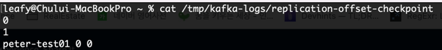

# Chapter 4. 카프카의 내부 동작 원리와 구현

## 카프카 리플리케이션
* 카프카는 고가용성을 위해 일시적인 하드웨어 이슈 등으로 브로커 한두 대에서 장애가 발생하더라도 서비스가 안정적으로 운영될 수 있도록 설계되었다.
* 카프카는 안정성 확보를 위해 리플리케이션이라는 동작을 한다.

### 리플리케이션 동작 개요
* 카프카는 일부 브로커에 장에가 발생하더라도 연속성 있는 서비스를 제공하고, 데이터 유실을 방지하기 위해 레플리케이션 동작을 한다.
* 카프카는 레플리케이션 동작을 위해 토픽 생성 시 필수값으로 replication factor 옵션을 설정해야 한다.
* 생성된 토픽의 파티션, 레플리케이션 등 토픽의 상세정보를 확인하려면 아래와 같이 describe 옵션을 사용하면 된다.

* PartitionCount, ReplicationFactor는 각각 파티션 수, 리플리케이션 팩터 수를 의미한다.
* 현재 브로커의 할당된 토픽의 Partition은 0이며, 파티션 수가 1이기 때문에 Leader 파티션 또한 0이다.
* Replicas는 리플리케이션이 존재하는 브로커 번호를 의미하며 여기서는 0번 브로커에 리플리케이션이 되고 있다. (replication factor 수가 1이므로)
* Isr은 현재 동기화되고 있는 리플리케이션의 브로커 번호를 나타낸다. (Isr은 InSyncReplica)
* 실제로 리플리케이션되는 것은 토픽이 아니라 토픽을 구성하는 파티션이다.
* 카프카 브로커 하나에 프로듀싱을 하더라도 리플리케이션이 되고 있다면 클러스터는 이를 공유하여 다른 브로커의 리플리케이션에서도 동일한 메시지를 저장하게 된다.
* N개의 리플리케이션이 있다면 N-1까지의 브로커 장애가 발생해도 메시지 손실 없이 안정적으로 메시지를 주고받을 수 있다.

### 리더와 팔로워
* 토픽의 파티선은 리더와 팔로워로 역할이 나뉘어 있다.
* 리더는 리플리케이션들 중 하나가 선정되며, 모든 읽기와 쓰기는 리더를 통해서만 가능하다.
  * 프로듀서는 모든 리플리케이션에 메시지를 보내는 것이 아니라 리더에게만 메시지를 전송하는 것이다.
  * 컨슈머 또한 리더에게서만 메시지를 가져온다.
* 리더를 제외한 나머지는 모두 팔로워이며, 리더에 문제가 발생하거나 이슈가 있을 경우를 대비해 새로운 리더가 될 준비를 해야한다.
  * 컨슈머가 메시지를 꺼내 가는 것과 비슷하게 지속적으로 파티션의 리더가 새로운 메시지를 받았는지 확인하고, 새로운 메시지가 있다면 해당 메시지를 리더로부터 복제한다.

### 복제 유지와 커밋
* 리더와 팔로워는 ISR(InSyncReplica)이라는 논리적 그룹으로 묶여있다.
  * 리더와 팔로워를 별도의 그룹으로 나누는 이유는 기본적으로 해당 그룹 안에 속한 팔로워들만이 새로운 리더로 선출될 수 있기 때문이다.
  * ISR 그룹에 속하지 못한 팔로워는 새로운 리더로 선출될 수 없다.

[참고 자료 링크](https://www.popit.kr/kafka-%EC%9A%B4%EC%98%81%EC%9E%90%EA%B0%80-%EB%A7%90%ED%95%98%EB%8A%94-topic-replication/)
* ISR 내의 팔로워들은 리더와의 데이터 일치를 유지하기 위해 지속적으로 리더의 데이터를 따라가게 되고, 리더는 ISR 내 모든 팔로워가 메시지를 받을 때까지 기다린다.
  * 팔로워가 네트워크 오류, 브로커 장애 등 여러 이유로 리더로부터 리플리케이션하지 못하는 경우도 발생할 수 있다.
  * 뒤처진 팔로워는 이미 리더와의 데이터가 불일치한 상태에 놓여 있으므로, 만약 이 팔로워에게 새로운 리더를 넘겨준다면 데이터의 정합성이나 메시지 손실 등의 문제가 발생할 수 있다.
  * 파티션의 리더는 팔로워들이 뒤처지지 않고 리플리케이션 동작을 잘하고 있는지 감시한다.
  * 리더에 뒤처지지 않고 리플리케이션이 잘되고 있는 팔로워들만이 ISR 그룹에 속하게 되며, 리더에게 장애가 발생할 경우 새로운 리더의 자격을 얻을 수 있다.
* 리더는 팔로워가 특정 주기의 시간만큼 복제 요청을 하지 않는다면, 리더는 해당 팔로워가 리플리케이션 동작에 문제가 발생했다고 판단해 ISR 그룹에서 추방한다.
* ISR 내에서 모든 팔로워의 복제가 완료되면, 리더는 내부적으로 커밋되었다는 표시를 하게된다.
  * 마지막 커밋 오프셋 위치는 하이워터마크(high water mark)라고 한다.
  * 커밋되었다는 의미는 리플리케이션 팩터 수의 모든 리플리케이션이 전부 메시지를 저장했음을 의미한다.
  * 커밋된 메시지들만 컨슈머가 읽어갈 수 있다.
* 커밋되지 않은 메시지들을 읽을 수 있게 허용한다면 동일한 토픽의 파티션에서 컨슘했음에도 메시지가 일치하지 않는 현상이 발생할 수 있다.
  * 카프카에서는 메시지가 불일치하게 되는 형상을 방지하고자 커밋된 메시지만 컨슈머가 읽어갈 수 있도록 구현되었다.
* 모든 브로커는 재시작될 때, 커밋된 메시지를 유지하기 위해 로컬 디스크의 replication-offset-checkpoint라는 파일에 마지막 커밋 오프셋 위치를 저장한다.
* replication-offset-checkpoint는 세그먼트와 마찬가지로 config/server.properties의 log.dirs 옵션에 설정된 경로에 저장된다.

* peter-tset01은 실습을 위해 생성한 토픽의 이름이다.
* 첫 번째 0은 파티션 번호, 두 번째 0은 커밋된 오프셋 번호를 뜻한다. (아직 프로듀싱을 한 번도 하지 않음)

* 위는 카프카에 메시지를 두 번 프로듀싱하고, 두 번 컨슈밍한 후의 체크포인트다.
* 다른 브로커에서도 리플리케이션이 되고 있다면 같은 오프셋 번호를 나타낸다.
