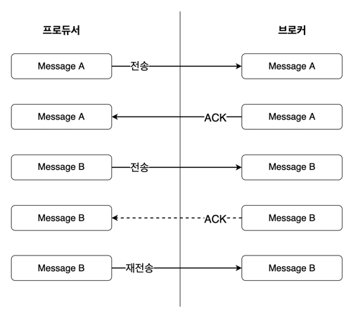
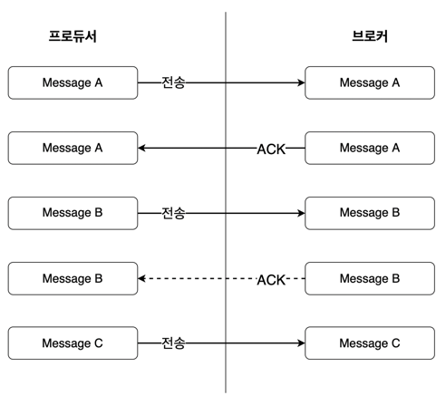
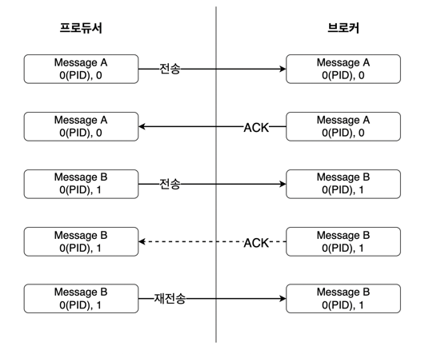
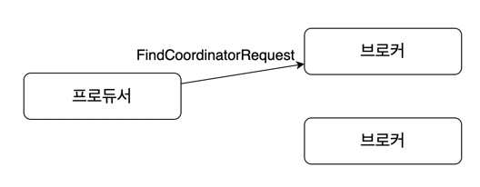
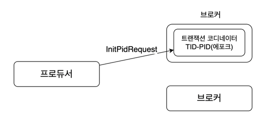
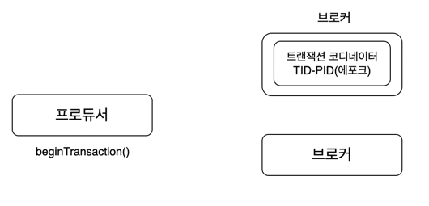

# Chapter 5. 프로듀서의 내부 동작 원리와 구현

## 파티셔너
* 카프카의 토픽은 성능 향상을 위한 병렬 처리가 가능하도록 파티션을 최소 하나 또는 둘 이상으로 구성할 수 있다.
* 프로듀서가 토픽으로 메시지를 보낼 때, 해당 토픽의 어느 파티션으로 보낼지는 파티셔너(partitioner)가 결정한다.
* 프로듀서가 파티션을 결정하는 알고리즘은 기본적으로 메시지의 키를 해시처리하여 구한다.
  * 메시지의 키 값이 동일하면 해당 메시지들은 모두 동일한 파티션으로 전송된다.
* 카프카는 처리량을 늘리기 위해 파티션을 늘릴 수 있지만, 파티션 수가 변경될 때, 메시지의 키와 매핑된 해시 테이블도 변경된다.
  * 같은 메시지 키로 전송하더라도 파티션 수를 늘린 후에는 다른 파티션으로 전송될 수 있다.

### 라운드 로빈(round-robin) 전략
* 프로듀서의 레코드 키 값은 필수값이 아니므로, 별도의 키를 지정하지 않고 전송한다면 기본 전략인 라운드 로빈 알고리즘을 사용하여 파티션을 결정하여 전송한다.
* 파티셔너를 거친 후의 레코드들은 배치 처리를 위해 프로듀서의 버퍼 메모리 영역에서 잠시 대기한 후에 카프카로 전송된다.
* 배치 처리를 위해 메시지들이 잠시 대기하는 과정에서 라운드 로빈 전략은 효율을 떨어뜨릴 수 있다.
  * 라운드 로빈 전략은 각 파티션에 순차적으로 메시지를 할당하므로, 각 파티션별로 배치 전송을 위한 레코드 수를 채울 때까지 메시지들은 카프카로 전송되지 못한 채 프로듀서 내에 대기하기 때문이다.
  * 프로듀서의 옵션을 조정해서 특정 시간을 초과하면 즉시 카프카로 레코드들을 전송하도록 설정할 수도 있다.
  * 하지만 배치와 압축의 효과를 얻지 못한 채 레코드를 카프카로 전송될 수 있기 때문에 비효율이 발생할 수 있다.

### 스티키 파티셔닝(sticky partitioning) 전략
* 라운드 로빈 전략에서 지연시간이 불필요하게 증가하는 비효율성을 개선하기 위해 카프카 2.4버전부터 공개된 전략이다.
* 스티키 파티셔닝 전략은 하나의 파티션에 레코드 수를 먼저 채워서 카프카로 빠르게 배치 전송하는 전략이다.
* 카프카로 전송하는 메시지의 순서가 중요하지 않은 경우라면 스티키 파티셔닝 전략을 적용하는 것이 좋다.

## 프로듀서의 배치
* 프로듀서는 배치 전송 방식은 불필요한 I/O을 줄일 수 있어 효율적이며, 카프카의 요청 수를 줄여주는 효과가 있다.
* 카프카의 사용 목적에 따라 처리량을 높일지, 지연 없는 전송을 해야 할지 적절하게 선택해야 한다.
* 대량의 메시지를 처리할 대 처리량을 높여야 하는 경우라면 배치 전송이 효율적이다.
* 지연 없는 전송이 목표라면 배치 전송 관련 설정을 제거해야 한다.
* 사용자는 전송 목표를 정하고 목적에 따라 프로듀서의 옵션값을 조금씩 조정해가면서 최적의 값을 찾아가는 것이 중요하다.
* 높은 처리량을 목표로 배치 전송을 설정하는 경우에 buffer.memory 크기는 반드시 batch.size보다 커야한다.
  * 프로듀서는 전송에 실패하면 재시도를 수행하는데, 이러한 부분까지 고려하여 버퍼 메모리를 설정해야 한다.
* 배치 전송과 더블어 압축 기능을 같이 사용하면, 더욱 효율적으로 카프카로 전송할 수 있다.
  * 높은 압축률이 필요하다면 gzip, snappy 포맷을, 낮은 지연시간이 필요하다면 lz4, snappy 포맷을 선택하는 것이 좋다.

## 중복없는 전송
* 카프카는 중복 없이 전송할 수 있는 기능을 제공한다. (멱등성 전송)
> 멱등성이란 동일한 작업을 여러 번 수행하더라도 결과가 달라지지 않는 성질을 의미한다.
* 메시지 시스템들의 전송 방식에는 '적어도 한 번 전송(at-least-once)', '최대 한 번 전송(at-most-once)', '정확히 한 번 전송(exactly-once)'이 있다.

* 위 그림은 적어도 한 번 전송 과정을 나타낸 그림이다.
  * 프로듀서가 브로커의 특정 토픽으로 메시지 A를 전송하고, 브로커는 잘 받았다는 ACK를 응답한다.
  * 브로커의 ACK를 받은 프로듀서는 다음 메시지인 메시지 B를 전송하고, 브로커는 메시지 B를 기록했지만 네트워크 오류 또는 브로커 장애가 발생하여 메시지 B에 대한 ACK를 응답하지 못한다.
  * 메시지 B를 전송한 후 브로커로부터 ACK를 받지 못한 프로듀서는 브로커가 메시지 B를 받지 못했다고 판단해 메시지 B를 재전송한다.
* 브로커는 메시지 B를 전달받아 저장하고 있지만, 프로듀서의 입장에서는 브로커가 메시지를 제대로 수신했는지 알 수가 없다.
* 이에따라 프로듀서는 적어도 한 번 전송 방식에 따라 메시지 B를 한 번 더 전송한다.
  * 브로커는 실제로 메시지를 받지 못한 상황이었다면 메시지를 그대로 저장할 것이고, 이미 메시지를 받았지만 ACK만 응답하지 못한 상황이었다면 중복 저장된다.
* 적어도 한 번 전송은 네트워크 회선 장애나 기타 장애 상황에 따라 메시지 중복이 발생할 수 있지만, 최소 하나의 메시지는 반드시 보장하며, 카프카는 기본적으로 적어도 한 번 전송 방식을 기반으로 동작한다.


* 위 그림은 최대 한 번 전송 과정을 나타낸 그림이다.
  * 프로듀서는 메시지 B를 브로커에 전송했지만, 브로커는 메시지 B를 기록하지 못하여 ACK를 응답하지 못하는 상황이다.
  * 프로듀서는 브로커가 메시지 B를 받았다고 가정하고, 메시지 C를 전송한다.
* 최대 한 번 전송은 ACK를 받지 못하더라도 재전송을 하지 않는다.
* 메시지 B에 대해서 브로커가 저장하지 못했을 수도 있고, 기록은 했지만 ACK만 응답하지 못했을 수도 있다.
* 최대 한 번 전송은 메시지 손실을 감안하더라도 중복 전송을 하지 않도록 한다.
* 주로 메시지 손실이 발생하더라도 높은 처리량을 필요로 하는 대량의 로그 수집이나 IoT 같은 환경에서 사용하곤 한다.

```text
적어도 한 번 전송은 메시지 손실 가능성은 없지만 메시지 중복 가능성이 존재한다.
최대 한 번 전송은 메시지 손실 가능성은 있지만 메시지 중복 가능성은 없다.
```


* 위 그림은 중복 없는 전송 과정이다.
  * 프로듀서는 브로커의 특정 토픽으로 메시지를 보낼 때, PID(Producer ID)와 메시지 번호를 헤더에 포함해 함께 전송한다.
  * 브로커는 메시지를 저장하고, PID와 메시지 번호를 메모리에 기록한다. 그리고 ACK를 응답한다.
  * 프로듀서는 다음 메시지를 브로커에게 PID는 동일하고 메시지 번호는 1 증가한 메시지를 전송한다.
  * 브로커는 다음 메시지를 저장하고 PID와 1 증가한 메시지 번호를 메모리에 기록한다. 이때 어떤 장애로 인해 ACK를 응답하지 못하면 프로듀서는 브로커가 메시지를 받지 못했다고 판단하여 재전송한다.
  * 프로듀서가 재전송한 메시지를 받은 브로커는 PID와 메시지 번호를 비교해서 해당 메시지가 이미 저장되어 있다면 중복 저장하지 않고 ACK만 보낸다.
* 프로듀서는 중복 없는 전송을 시작하면, PID를 할당받고, 이 PID와 메시지에 대한 번호를 메시지의 헤더에 포함해 메시지를 전송하게 된다. 메시지 번호는 시퀀스 번호라고도 한다.
* 브로커에서는 각 메시지마다 PID와 시퀀스 번호를 메모리에 유지하여 브로커에 기록된 메시지들의 중복 여부를 알 수 있다.
* PID는 사용자가 별도로 생성하는 것이 아니라 프로듀서에 의해 자동 생성된다.
* PID는 프로듀서와 카프카 사이에서 내부적으로만 이용되므로 사용자에게 따로 노출되지는 않으며, 시퀀스 번호는 0부터 순차적으로 증가한다.
* 프로듀서에서 시퀀스 번호를 메시지마다 증가시키는 방법과 동일하게, 브로커에서도 기록되는 메시지들에 대해 시퀀스 번호를 증가시킨다.
  * 따라서 프로듀서가 보낸 메시지의 시퀀스 번호가 브로커가 갖고 있는 시퀀스 번호보다 정확하게 큰 경우가 아니라면, 브로커는 프로듀서의 메시지를 저장하지 않는다. (덕분에 중복 저장을 피할 수 있다.)
* PID와 시퀀스 번호는 브로커의 메모리에 유지되고, 리플리케이션 로그에도 저장되므로 브로커의 장애로 리더가 바뀌더라도 새로운 리더가 PID와 시퀀스 번호를 정확히 알 수 있으므로 중복 없는 메시지 전송이 가능하다.
* 카프카는 메시지에 단순한 숫자 필드만 추가하여 비교하여 이로 인한 오버헤드를 줄였다.
  * 기존 대비 최대 약 20%정도만 성능이 감소했다고 한다.
* 프로듀서 전송 성능에 민감하지 않은 상황에서 중복 없는 메시지가 필요하다면 이 방식을 사용해 볼만하다.

## 정확히 한 번 전송 (exactly-once)
* 멱등성 옵션을 이용한 중복 없는 전송 방식이 정확히 한 번 전송한다는 의미는 아니다.
* 카프카에서 정확히 한 번 전송은 트랜잭션과 같은 전체적인 프로세스 처리를 의미한다.
* 전체적인 프로세스 관리를 관리하기 위해 카프카에서는 정확히 한 번 처리를 담당하는 별도의 프로세스가 있는데, 이를 트랜잭션 API라고 한다.

### 디자인
* 프로듀서가 카프카로 정확히 한 번 방식으로 메시지를 전송할 때, 프로듀서가 보내는 메시지를 원자적으로 처리하여 전송에 성공하거나 실패한다.
* 프로듀서의 이러한 전송을 위해 카프카에는 컨슈머 그룹 코디네이터와 동일한 개념으로 트랜잭션 코디네이터(transaction coordinator)라는 것이 브로커에 존재한다.
* 트랜잭션 코디네이터는 프로듀서에 의해 전송된 메시지를 관리하며, 커밋 또는 중단 표시를 한다.
* 트랜잭션 로그를 카프카의 내부 토픽인 _transaction_state에 저장한다.
* 프로듀서는 _transaction_state 토픽에 트랜잭션 로그를 직접 기록하지 않는다.
  * 프로듀서가 트랜잭션 관련 정보를 트랜잭션 코디네이터에게 알리고, 모든 정보의 로그는 트랜잭션 코디네이터가 직접 기록한다.
* 정확히 한 번 전송을 이용해 전송된 메시지들이 카프카에 저장되면, 카프카의 메시지를 다루는 클라이언트들은 해당 메시지들이 정상적으로 커밋된 것인지 또는 실패한 것이지 식별하기 위해 컨트롤 메시지라고 불리는 특별한 타입의 메시지를 추가로 사용한다.
* 컨트롤 메시지는 페이로드에 애플리케이션 데이터를 포함하지 않으며, 브로커와 클라이언트 통신에서만 사용된다.

### 프로듀서 예제 코드
```java
public class ExactlyOnceProducer {
    public static void main(String[] args) {
        String bootstrapServers = "peter-kafka01.foo.bar:9092";
        Properties props = new Properties();
        props.setProperty(BOOTSTRAP_SERVERS_CONFIG, bootstrapServers);
        props.setProperty(KEY_SERIALIZER_CLASS_CONFIG, StringSerializer.class.getName());
        props.setProperty(VALUE_SERIALIZER_CLASS_CONFIG, StringSerializer.class.getName());
        props.setProperty(ENABLE_IDEMPOTENCE_CONFIG, "true"); // 정확히 한번 전송을 위한 설정
        props.setProperty(ACKS_CONFIG, "all"); // 정확히 한번 전송을 위한 설정
        props.setProperty(MAX_IN_FLIGHT_REQUESTS_PER_CONNECTION, "5"); // 정확히 한번 전송을 위한 설정
        props.setProperty(RETRIES_CONFIG, "5"); // 정확히 한번 전송을 위한 설정
        props.setProperty(TRANSACTIONAL_ID_CONFIG, "peter-transaction-01"); // 정확히 한번 전송을 위한 설정 (프로듀서 프로세스마다 고유한 아이디로 설정해야 한다.)

        Producer<String, String> producer = new KafkaProducer<>(props);

        producer.initTransactions(); // 프로듀서 트랜잭션 초기화
        producer.beginTransaction(); // 프로듀서 트랜잭션 시작
        try {
            for (int i = 0; i < 1; i++) {
                ProducerRecord<String, String> record = new ProducerRecord<>("peter-test05", "Apache Kafka is a distributed streaming platform - " + i);
                producer.send(record);
                producer.flush();
                System.out.println("Message sent successfully");
            }
        } catch (Exception e){
            producer.abortTransaction(); // 프로듀서 트랜잭션 중단
            e.printStackTrace();
        } finally {
            producer.commitTransaction(); // 프로듀서 트랜잭션 커밋
            producer.close();
        }
    }
}
```
* 위 설정에서 TRANSACTION_ID_CONFIG는 프로듀서 프로세스 별로 고유해야 한다.

### 단계별 동작

* 정확히 한 번 전송을 위해 프로듀서는 FindCoordinatorRequest 요청을 통해 트랜잭션 코디네이터 위치를 찾는다.
  * 트랜잭션 코디네이터는 브로커에 위치해 있다.
  * 트랜잭션 코디네이터의 주 역할은 PID와 transactional.id를 매핑하고 해당 트랜잭션 전체를 관리하는 것이다.
  * 만약 트랜잭션 코디네이터가 존재하지 않는다면 신규 트랜잭션 코디네이터가 생성된다.
* _transaction_state 토픽의 파티션 번호는 transactional.id를 기반으로 해시하여 결정하고, 이 파티션의 리더가 있는 브로커가 트랜잭션 코디네이터로 선정된다. (transaction.id가 정확히 하나의 코디네이터만 갖고 있다.) 


* 프로듀서는 initTransactions() 메서드를 이용해 트랜잭션 전송을 위한 InitPidRequest를 트랜잭션 코디네이터로 보낸다.
* TID(transaction.id)가 설정된 경우에는 InitPidRequest와 함께 TID가 트랜잭션 코디네이터에게 전송된다.
* 트랜잭션 코디네이터는 TID, PID를 매핑하고 해당 정보를 트랜잭션 로그에 기록한다.
* 트랜잭션 로그를 기록한 후에 PID 에포크(epoch)를 한 단계 올리고, 이후부터는 동일한 PID와 이전 에포크에 대한 쓰기 요청은 무시된다.


* 프로듀서는 beginTransaction() 메서드를 이용해 새로운 트랜잭션 시작을 알린다.
  * 프로듀서는 내부적으로만 트랜잭션이 시작됐음을 기록하고, 트랜잭션 코디네이터 관점에서는 첫 번째 레코드가 전송될 때까지 트랜잭션이 시작된 것은 아니다.
* 프로듀서는 토픽 파티션 정보를 트랜잭션 코디네이터에게 전달하고, 트랜잭션 코디네이터는 해당 정보를 트랜잭션 로그에 기록한다. 트랜잭션의 현재 상태는 Ongoing으로 표시한다.
* 트랜잭션 코디네이터는 해당 트랜잭션에 대해 기본값인 1분 동안 트랜잭션 상태 업데이트가 없다면 해당 트랜잭션은 실패로 처리한다.
* 프로듀서는 대상 토픽의 파티션으로 메시지를 전송하고, 해당 메시지에는 PID, 에포크, 시퀀스 번호가 함께 포함되어 있다.
* 메시지 전송을 완료한 프로듀서는 commitTransaction() 메서드 또는 abortTransaction() 메서드를 호출하여, 트랜잭션이 완료됨을 트랜잭션 코디네이터에게 알린다.
* 트랜잭션 코디네이터는 두 단계의 커밋 과정을 거친다.
  * 첫 번째는 트랜잭션 로그에 해당 트랜잭션에 대한 PrepareCommit 또는 PrepareAbort를 기록한다.
  * 두 번재는 트랜잭션 로그에 기록된 토픽의 파티션에 트랜잭션 커밋 표시를 기록한다.
* 트랜잭션 코디네이터는 메시지를 받았던 파티션에 트랜잭션 커밋 표시 메시지를 기록하고, 이 추가 메시지로 인해 해당 파티션의 오프셋이 1 증가하게 된다.
  * 트랜잭션 커밋 표시 메시지는 컨트롤 메시지라고 하며, 해당 PID의 메시지가 제대로 전송됐는지 여부를 컨슈머에게 나타내는 용도로도 사용된다.
  * 트랜잭션이 커밋이 끝나지 않은 메시지는 컨슈머에게 반환하지 않는다.
  * 오프셋의 순서 보장을 위해 트랜잭션 성공 또는 실패를 나타내는 LSO(last stable offest)라는 오프셋을 유지하게 된다.
* 마지막으로 트랜잭션 코디네이터는 트랜잭션을 Committed라고 트랜잭션 로그에 기록하여 트랜잭션을 완료한다. 그리고 프로듀서에게 해당 트랜잭션이 완료됨을 알린다.
* 트랜잭션을 이용하는 컨슈머는 read_committed설정을 하면 트랜잭션에 성공한 메시지들만 읽을 수 있다.
