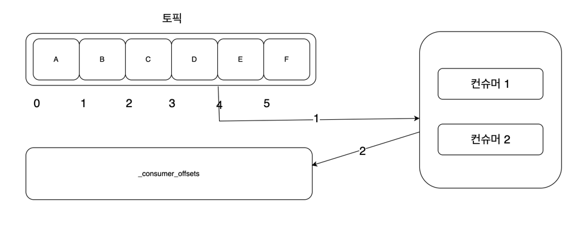

# Chapter 6. 컨슈머의 내부 동작 원리와 구현

## 컨슈머 오프셋 관리
* 카프카는 오프셋을 통해 메시지의 위치를 나타내며, 오프셋은 숫자 형태다.
* 컨슈머 그룹은 자신의 오프셋 정보를 카프카의 저장소인 토픽에 저장한다.
  * _consumer_offsets 토픽에 각 컨슈머 그룹별로 오프셋 위치 정보가 기록된다.

* 컨슈머 그룹에 컨슈머 1과 2가 존재하고, 컨슈머들은 메시지를 읽으면, 읽은 위치의 오프셋 정보를 _consumer_offsets에 기록한다.
* 컨슈머 그룹은 컨슈머 그룹, 토픽, 파티션 등의 내용을 통합해 기록한다.
* _consumer_offsets 토픽에 기록된 정보를 이용해 컨슈머 그룹은 자신의 그룹이 속해 있는 컨슈머의 변경이 발생하는 경우에 해당 컨슈머가 어느 위치까지 읽었는지 추적할 수 있다.
* _consumer_offsets에 저장되는 오프셋값은 컨슈머가 마지막까지 읽은 위치가 아니라 컨슈머가 다음으로 읽어야 할 위치다.
* 위 예시에서는 오프셋 메시지 D까지 읽었고, 그 다음으로 읽어야 할 4번 오프셋 위치를 _consumer_offsets 토픽에 저장한다.
* 모든 컨슈머 그룹의 정보가 저장되는 _consumer_offsets 토픽은 파티션 수와 리플리케이션 팩터 수를 갖고 있다.

## 그룹 코디네이터
* 컨슈머들은 하나의 컨슈머 그룹의 구성원에 속하며, 컨슈머 그룹 내의 각 컨슈머들은 서로 자신의 정보를 공유하면서 하나의 공동체로 동작한다.
* 컨슈머 그룹 내의 컨슈머들은 자신이 속한 컨슈머 그룹에서 떠날 수 있으며 새로운 컨슈머가 합류할 수도 있다.
* 컨슈머 그룹은 이러한 변화를 인지하고 각 컨슈머들에게 작업을 균등하게 분배해야 하는데, 이 동작을 컨슈머 리밸런싱(consumer rebalancing)이라고 한다.
* 카프카에서는 컨슈머 그룹을 관리하기 위해 그룹 코디네이터가 존재한다.
* 그룹 코디네이터는 컨슈머 그룹이 구독한 토픽의 파티션들과 그룹의 멤버들을 트래킹한며, 파티션 또는 그룹의 멤버에 변화가 생기면 작업을 균등하게 재분배하기 위해 컨슈머 리밸런싱 동작이 발생한다.
* 그룹 코디네이터는 각 컨슈머 그룹별로 존재하며, 카프카 클러스터 내의 브로커 중 하나에 위치한다.
* 컨슈머 그룹이 브로커에게 최초 연결 요청을 보내면 브로커 중 하나에 그룹 코디네이더가 생성된다.
* 생성된 그룹 코디네이터는 컨슈머 그룹의 컨슈머 변경과 구독하는 토픽 파티션 변경 등에 대한 감지를 시작하고, 토픽의 파티션과 그룹의 멤버 변경이 일어나면 변경된 내용을 컨슈머들에게 알려준다.
* 컨슈머 그룹 등록 동작 과정은 아래와 같다.
  1. 컨슈머는 bootstrap.brokers 리스트에 있는 브로커에게 컨슈머 클라이언트와 초기 커넥션을 연결하기 위한 요청을 보낸다.
  2. 요청을 받은 브로커는 그룹 코디네이터를 생성하고 컨슈머에게 응답을 보낸다.
  3. 그룹 코디네이터는 group.initial.rebalance.delay.ms의 시간동안 컨슈머의 요청을 기다린다.
  4. 컨슈머는 컨슈머 등록 요청을 그룹 코디네이터에게 보낸다. (가장 먼저 요청을 보내는 컨슈머가 컨슈머 그룹의 리더가 된다.)
  5. 컨슈머 등록 요청을 받은 그룹 코디네이터는 해당 컨슈머 그룹이 구독하는 토픽 파티션 리스트 등 리더 컨슈머의 요청에 응답을 보낸다.
  6. 리더 컨슈머는 정해진 컨슈머 파티션 할당 전략에 따라 그룹 내 컨슈머들에게 파티션을 할당한 뒤 그룹 코디네이터에게 전달한다.
  7. 그룹 코디네이터는 해당 정보를 캐시하고 각 그룹 내 컨슈머들에게 성공을 알린다.
  8. 각 컨슈머들은 각자 지정된 토픽 파티션으로부터 메시지들을 가져온다.
* 컨슈머 그룹의 변화들은 컨슈머 코디네이터에게 컨슈머가 join 또는 leave 요청을 보냄으로써 자연스럽게 처리된다.
* 그룹 코디네이터와 컨슈머들은 서로 하트비트를 주고받으며, 컨슈머가 장애로 인해 leave 요청을 보내지 못하고 종료되는 경우에도 변화를 감지할 수 있다.
* 코디네이터는 하트비트 옵션을 통해 컨슈머의 상태를 확인하며, 특정 컨슈머에 문제가 발생했다고 판단되면 컨슈머 리밸런싱 동작을 통해 컨슈머 그룹의 전체 균형을 다시 맞춘다.
* 컨슈머 리밸런싱 동작은 경우에 따라 매우 높은 비용이 지출되므로 가급적 리밸런싱이 자주 발생하지 않도록 주의해야 한다.

## 스태틱 멤버십
* 컨슈머 리밸런싱은 재시작되거나 그룹에서 떠나는 컨슈머만 대상으로 동작하는 것이 아니라, 컨슈머 그룹 내 전체 컨슈머를 대상으로 동작한다.
  * 변화와 상관없는 컨슈머가 담당하던 파티션이 이전과 달라질 수 있다는 의미다.
  * 컨슈머가 복구되어 다시 컨슈머 그룹에 합류하게 되는 경우에도 리밸런싱이 발생한다.
* 컨슈머 리밸런싱 동작은 일시적으로 모든 컨슈머가 일시 중지하게 되는데, 이는 대량의 메시지를 컨슘하는 컨슈머 그룹에게는 부담이 큰 고비용의 작업이다.
* 스태틱 멤버십이란 컨슈머 그룹 내에서 컨슈머가 재시작 등으로 그룹에서 나갔다가 다시 합류하더라도 리밸런싱이 일어나지 않게 한다.
* 컨슈머마다 인식할 수 있는 ID를 적용하여 다시 합류할 때 그룹 코디네이터가 기존 구성원임을 인식할 수 있게 한다.
* 스태틱 멤버십 기능이 적용된 컨슈머는 그룹을 떠날 때 그룹 코디네이터에게 알리지 않으므로 불필요한 리밸런싱이 발생하지 않는다.
* group.instance.id를 설정하면 스태틱 멤버십이 적용된다. 기본값은 null이며, 아파치 카프카 버전이 2.3 이상이어야 한다.
* group.instance.id 옵션에는 그룹 코디네이터가 컨슈머를 식별하기 위해 컨슈머 인스턴스별로 고유한 값을 입력해야 한다.
* 스태틱 멤버십 기능을 적용하는 경우에는 session.timeout.ms를 기본값보다는 큰 값으로 조정해야 한다.
  * 컨슈머를 재시작한 후 session.timeout.ms 값에 지정된 시간동안 그룹 코디네이터가 하트비트를 받지 못하면 강제로 리밸런싱이 일어나기 때문이다.

## 컨슈머 파티션 할당 전략
* 컨슈머 그룹의 리더 컨슈머가 정해진 파티션 할당 전략에 따라 각 컨슈머와 대상 토픽의 파티션을 매칭시킨다.
* 파티션 할당 전략은 컨슈머 옵션의 partition.assignment.strategy로 표시하며, 아래와 같이 총 네 가지 전략을 제공한다.
  * RangeAssignor (레인지 파티션 할당 전략)
  * RoundRobinAssignor (라운드로빈 파티션 할당 전략)
  * StickyAssignor (스티키 파티션 할당 전략)
    * 컨슈머가 컨슘하고 있는 파티션을 계속 유지한다.
  * CooperativeStickyAssignor (협력적 스티키 파티션 할당 전략)
    * 스티키 방식과 유사하지만, 전체 일시 정지가 아닌 연속적인 재조정 방식이다.

### 레인지 파티션 할당 전략
* 파티션 할당 전략의 기본값이며, 토픽별로 할당 전략을 사용한다. 동일한 키를 이용하는 2개 이상의 토픽을 컨슘할 때 유용하다.
* 먼저 구독하는 토픽에 대한 파티션을 순서대로 나열한 후 컨슈머를 순서대로 정렬하고, 전체 파티션 수 / 전체 컨슈머 수로 나눈 몫만큼 각 파티션을 컨슈머에 할당하고, 남은 파티션은 먼저 정렬된 컨슈머에 할당한다.
* 레인지 파티션 할당 전략은 동일한 레코드 키를 사용하고 하나의 컨슈머 그룹이 동일한 파티션 수를 가지는 2개 이상의 토픽을 컨슘할 때 유용할 수 있다.
* 컨슈머에게 균등하게 파티션이 분배되지 않으므로 컨슈머 그룹이 불균형한 상태로 운영될 수 있다.

### 라운드 로빈 파티션 할당 전략
* 컨슘해야 하는 모든 파티션과 컨슈머 그룹 내 모든 컨슈머를 나열한 후 라운드 로빈으로 하나씩 파티션과 컨슈머를 할당하는 전략이다.
* 파티션과 컨슈머를 균등하게 맵핑할 수 있다.

### 스티키 파티션 할당 전략
* 컨슈머 그룹이 리밸런싱 동작으로 인해 파티션이 재할당 되는 경우, 기존에 맵핑됐던 파티션과 컨슈머가 다시 맵핑된다고 보장할 수 없다.
  * 리밸런싱이 일어나더라도 기존에 맵핑됐던 파티션과 컨슈머를 최대한 유지하려고 하는 전략이 스티키 파티션 할당 전략이다.
* 스트키 파티션 할당 전략은 두 가지 목적으로 컨슈머에 파티션을 할당한다.
  * 첫 번째는 가능한 한 균형 잡힌 파티션 할당이다.
  * 두 번째는 재할당이 발생할 때 되도록 기존의 할당된 파티션 정보를 보장하는 것이다.
  * 두 목적 중에서 첫 번째 목적이 우선순위가 더 높기 때문에 스티키 전략이라고 해서 무조건 기존의 파티션과 컨슈머를 유지하지는 않는다.
  * 스티키 파틱션 할당 전략은 최초 배치시에는 라운드 로빈 할당 전략과 유사하다.
* 스티키 파티션 할당 전략은 다음과 같은 규칙으로 재할당 동작을 수행한다.
  * 컨슈머들의 최대 할당된 파티션 수의 차이는 1
  * 기존에 존재하는 파티션 할당은 최대한 유지
  * 재할당 동작 시 유효하지 않은 모든 파티션 할당은 제거함
  * 할당되지 않은 파티션들은 균형을 맞추는 방법으로 컨슈머들에게 할당

### 협력적 스티키 파티션 할당 전략
* 협력적 스티키 파티션 할당 전략은 스티키 파티션 할당 전략과 기본적으로는 동일한 전략 방식이지만 컨슈머 그룹 내부의 리밸런싱 동작이 한층 더 고도화되었다.
* 컨슈머 리밸런싱 동작에서는 내부적으로 EAGER라는 리밸런스 프로토콜을 사용했다.
  * EAGER 프로토콜은 컨슈머 리밸런싱 동작 시 컨슈머에 할당된 모든 파티션을 항상 취소한다.
  * 컨슈머에 할당된 모든 파티션을 취소하는 이유는 컨슈머들의 파티션 소유권 변경 때문이다.
* 리밸런싱에서 모든 파티션 할당을 취소하는 동작은 리소스를 많이 사용하는 컨슈머 그룹에서는 컨슈머들의 다운타임 때문에 문제가 될 수 있다. (다운타임 동안 컨슈머 LAG이 급증하기 때문이다.)
* 협력적 스티키 파티션 할당 전략은 내부 리밸런싱 프로토콜인 EAGER 대신에 COOPERATIVE 프로토콜을 적용하였다.
* COOPERATIVE 프로토콜은 동작 중인 컨슈머들에 대해서는 영향을 주지 않는 상태에서 몇 차례에 걸쳐 리밸런싱이 이루어진다.
* 한 번에 일괄 작업하는 EAGER 방식보다 COOPERATIVE 프로토콜이 더 빠른 시간 안에 짧은 다운타임을 가지고 리밸런싱을 완료한다.

## 정확히 한 번 컨슈머 동작
* 컨슈머는 트랜잭션 코디네이터에 의해 성공 표시된 메시지만 읽음으로써 정확히 한 번 읽을 수 있다.
* 트랜잭션 컨슈머는 컨슈머 코드의 ISOLATION_LEVEL_CONFIG 옵션에 read_committed를 설정하면 트랜잭션이 완료된 읽을 수 있게된다. (기본값은 read_uncommitted)
* 트랜잭션 메시지는 트랜잭션의 성공 여부를 확인하는 목적으로만 활용하고 사용자에게 보여주지는 않는다.
* 컨슈머는 트랜잭션 코디네이터와 통신하는 부분이 없으므로 정확하게 메시지를 한 번 가져오는지는 보장할 수 없다.
* 컨슈머 동작까지 정확히 한 번 처리가 가능해지려면 '컨슘-메시지 처리-프로듀싱' 동작이 모두 하나의 트랜잭션으로 처리되어야 한다.
  * sendOffsetsToTransaction 메서드를 이용하여 컨슈머 그룹의 오프셋 커밋을 트랜잭션에 포함시킴으로써 트랜잭션이 실패했을 경우, 해당 컨슈머의 오프셋을 증가하지 않게 하여 트랜잭션을 다시 시작할 수 있다.
* 카프카 커넥트 중에서 HDFS 커넥터의 경우, 정확히 한 번 HDFS에 저장하도록 지원하기도 한다.
